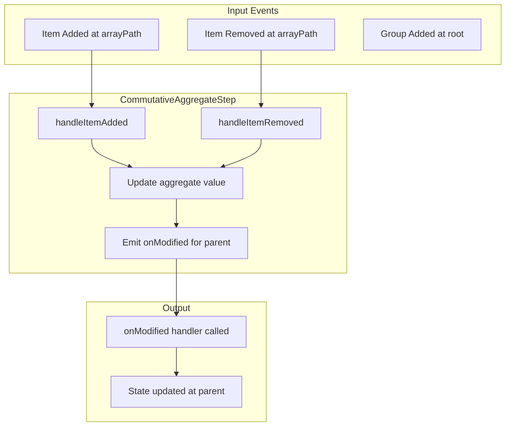
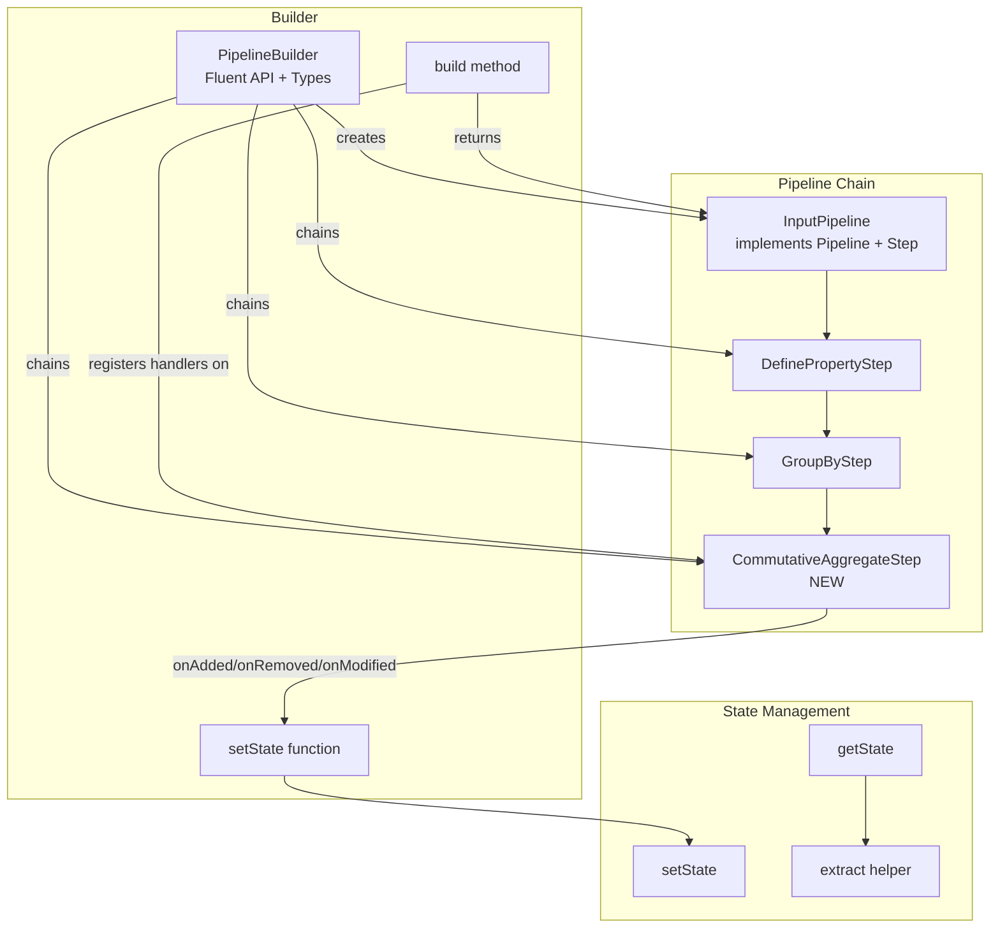

# Architecture Analysis for `commutativeAggregate` Design

## Executive Summary

This document analyzes the existing pipeline architecture to inform the design of a new `commutativeAggregate` operation. The operation will compute aggregate values (like sum, count, min, max) that can be updated incrementally as items are added or removed from groups.

---

## 1. Pipeline Architecture Overview

### Core Interfaces (from [`pipeline.ts`](../src/pipeline.ts))

The pipeline uses an **event-driven, observer pattern** architecture with three primary event types:

```typescript
// Core handler types
type AddedHandler = (path: string[], key: string, immutableProps: ImmutableProps) => void;
type RemovedHandler = (path: string[], key: string) => void;
type ModifiedHandler = (path: string[], key: string, name: string, value: any) => void;
```

### The Step Interface

Every operation in the pipeline implements the [`Step`](../src/pipeline.ts:38) interface:

```typescript
interface Step {
    getTypeDescriptor(): TypeDescriptor;
    onAdded(pathNames: string[], handler: AddedHandler): void;
    onRemoved(pathNames: string[], handler: RemovedHandler): void;
    onModified(pathNames: string[], handler: ModifiedHandler): void;
}
```

**Key Insight:** Steps register handlers with their upstream input step and expose their own handlers for downstream steps. This creates a chain of transformations.

### TypeDescriptor - Understanding Tree Structure

The [`TypeDescriptor`](../src/pipeline.ts:6) describes the shape of nested arrays in the output:

```typescript
interface TypeDescriptor {
    arrays: ArrayDescriptor[];  // List of nested array properties
}

interface ArrayDescriptor {
    name: string;               // Property name (e.g., 'items', 'cities')
    type: TypeDescriptor;       // Recursive descriptor for nested arrays
}
```

**Example:** After `groupBy(['state'], 'cities').groupBy(['city'], 'towns')`:
```typescript
{
    arrays: [{
        name: 'cities',
        type: {
            arrays: [{
                name: 'towns',
                type: { arrays: [] }
            }]
        }
    }]
}
```

---

## 2. Path System - Navigating the Tree

### Path Names vs Runtime Paths

1. **Path Names (Static):** Array of property names describing a level in the tree structure
   - Example: `['cities', 'towns']` - the towns array inside cities

2. **Runtime Paths:** Array of hash keys identifying a specific location at runtime
   - Example: `['hash_TX', 'hash_Dallas']` - a specific city inside a specific state group

### Handler Registration

Steps use `pathNames` to determine which handlers to register:

```typescript
// In GroupByStep.onAdded()
if (pathNames.length === 0) {
    // Handler is at the group level (root of this step's output)
    this.groupAddedHandlers.push(handler);
} else if (pathNames.length === 1 && pathNames[0] === this.arrayName) {
    // Handler is at the item level (inside the array)
    this.itemAddedHandlers.push(handler);
} else if (pathNames.length > 1 && pathNames[0] === this.arrayName) {
    // Handler is below this array - intercept and pass to input
    const shiftedPath = pathNames.slice(1);
    this.input.onAdded(shiftedPath, ...);
}
```

---

## 3. Step Implementation Patterns

### Pattern A: Simple Transform - DefinePropertyStep

[`DefinePropertyStep`](../src/steps/define-property.ts) demonstrates the simplest pattern - transform data as it passes through:

```typescript
class DefinePropertyStep<T, K extends string, U> implements Step {
    constructor(private input: Step, private propertyName: K, 
                private compute: (item: T) => U) {}
    
    getTypeDescriptor(): TypeDescriptor {
        return this.input.getTypeDescriptor();  // Pass through unchanged
    }
    
    onAdded(pathNames: string[], handler: AddedHandler): void {
        this.input.onAdded(pathNames, (path, key, immutableProps) => {
            // Transform by adding computed property
            handler(path, key, { 
                ...immutableProps, 
                [this.propertyName]: this.compute(immutableProps as T) 
            });
        });
    }
    
    onRemoved(pathNames: string[], handler: RemovedHandler): void {
        this.input.onRemoved(pathNames, handler);  // Pass through unchanged
    }
    
    onModified(pathNames: string[], handler: ModifiedHandler): void {
        this.input.onModified(pathNames, handler);  // Pass through unchanged
    }
}
```

**Key Characteristics:**
- No internal state
- Type descriptor unchanged
- Transforms `onAdded` events only
- Passes through `onRemoved` and `onModified` unchanged

### Pattern B: Filtering - DropPropertyStep

[`DropPropertyStep`](../src/steps/drop-property.ts) removes a property from the output:

```typescript
onAdded(pathNames: string[], handler: AddedHandler): void {
    this.input.onAdded(pathNames, (path, key, immutableProps) => {
        const { [this.propertyName]: _, ...rest } = immutableProps;
        handler(path, key, rest as Omit<T, K>);
    });
}
```

### Pattern C: Restructuring with State - GroupByStep

[`GroupByStep`](../src/steps/group-by.ts) is the most complex, maintaining internal state:

```typescript
class GroupByStep<T extends {}, K extends keyof T, ArrayName extends string> {
    // Maps for tracking group membership
    keyToGroupHash: Map<string, string> = new Map();
    groupToKeys: Map<string, Set<string>> = new Map();
    
    // Separate handler arrays for different path levels
    groupAddedHandlers: AddedHandler[] = [];
    itemAddedHandlers: AddedHandler[] = [];
    groupRemovedHandlers: RemovedHandler[] = [];
    itemRemovedHandlers: RemovedHandler[] = [];
}
```

**Key Characteristics:**
- Maintains bidirectional mappings between items and groups
- Emits events at multiple levels (groups and items)
- Handles nested path routing through interceptors
- Creates new array structure in TypeDescriptor

---

## 4. The Builder and Factory Pattern

### PipelineBuilder

[`PipelineBuilder`](../src/builder.ts:13) provides the fluent API and type inference:

```typescript
class PipelineBuilder<TStart, T extends {}> {
    constructor(private input: Pipeline<TStart>, private lastStep: Step) {}
    
    defineProperty<K extends string, U>(propertyName: K, compute: (item: T) => U)
        : PipelineBuilder<TStart, T & Record<K, U>> { ... }
    
    groupBy<K extends keyof T, ArrayName extends string>(keyProperties: K[], arrayName: ArrayName)
        : PipelineBuilder<TStart, Expand<{...}>> { ... }
    
    build(setState: (transform: Transform<KeyedArray<T>>) => void, 
          typeDescriptor: TypeDescriptor): Pipeline<TStart> { ... }
}
```

**Key Insight:** The type parameter `T` transforms through the chain, accumulating type changes from each operation.

### KeyedArray Output Type

The output structure uses [`KeyedArray<T>`](../src/builder.ts:7):

```typescript
type KeyedArray<T> = { key: string, value: T }[];
```

This allows efficient updates by key. The builder's helper functions ([`addToKeyedArray`](../src/builder.ts:72), [`removeFromKeyedArray`](../src/builder.ts:107), [`modifyInKeyedArray`](../src/builder.ts:142)) recursively navigate the path to update the correct location.

---

## 5. The onModified Pattern

`onModified` is crucial for `commutativeAggregate` because aggregates need to update when computed values change.

### Current Usage

From [`pipeline.ts:23`](../src/pipeline.ts:23):
```typescript
type ModifiedHandler = (path: string[], key: string, name: string, value: any) => void;
```

- `path`: Runtime path to the modified item
- `key`: The item's unique key
- `name`: The property name being modified
- `value`: The new value

### How Steps Handle onModified

1. **DefinePropertyStep/DropPropertyStep:** Pass through to input unchanged
2. **GroupByStep:** Routes based on path, prepending group hash to runtime path
3. **InputPipeline:** No-op (input is immutable)

**Key Insight:** `onModified` is currently underutilized - it exists for future computed/aggregate properties that need to signal changes.

---

## 6. Test Patterns

### Test Helper Usage

From [`helpers.ts`](../src/test/helpers.ts):

```typescript
// Creates a test pipeline with state management
const [pipeline, getOutput] = createTestPipeline(() => 
    createPipeline<{ category: string, value: number }>()
        .groupBy(['category'], 'items')
);

// Add items
pipeline.add("item1", { category: 'A', value: 10 });

// Inspect output
const output = getOutput();
expect(output[0].items).toEqual([{ value: 10 }]);
```

### Type Extraction

[`BuilderOutputType<T>`](../src/test/helpers.ts:16) extracts the output type from a builder, converting `KeyedArray<T>` to `T[]` recursively.

---

## 7. Recommendations for `commutativeAggregate`

### 7.1 Design Overview

A `commutativeAggregate` should compute values over arrays at a specific path level. It's "commutative" because the aggregate result doesn't depend on item order (sum, count, min, max, etc.).

### 7.2 Proposed API

```typescript
// After groupBy, add an aggregate property to each group
.commutativeAggregate<'totalValue', number>(
    'items',           // path to the array to aggregate
    'totalValue',      // name of the new property
    (values: { value: number }[]) => values.reduce((sum, v) => sum + v.value, 0)
)
```

Or with a stateful aggregator pattern for efficiency:

```typescript
// More efficient for incremental updates
.commutativeAggregate(
    'items',           // path to aggregate
    'totalValue',      // property name
    {
        zero: () => 0,
        add: (acc, item) => acc + item.value,
        remove: (acc, item) => acc - item.value
    }
)
```

### 7.3 Implementation Pattern

The step should follow the "stateful transform" pattern like GroupByStep:

```typescript
class CommutativeAggregateStep<T, ArrayPath, PropName, R> implements Step {
    // Track current aggregate values by parent key
    private aggregateValues: Map<string, R> = new Map();
    
    // Track items contributing to each aggregate
    private itemsByParent: Map<string, Map<string, any>> = new Map();
    
    constructor(
        private input: Step,
        private arrayPath: string[],    // Path to the array to aggregate
        private propertyName: PropName,
        private aggregator: {
            zero: () => R,
            add: (acc: R, item: any) => R,
            remove: (acc: R, item: any) => R
        }
    ) {
        // Register for items at the array path
        this.input.onAdded(arrayPath, this.handleItemAdded.bind(this));
        this.input.onRemoved(arrayPath, this.handleItemRemoved.bind(this));
    }
}
```

### 7.4 Event Flow



### 7.5 Type System Integration

The builder method should add the aggregate property to the parent level type:

```typescript
// In PipelineBuilder
commutativeAggregate<ArrayPath extends string, PropName extends string, R>(
    arrayPath: ArrayPath,
    propertyName: PropName,
    aggregator: Aggregator<ArrayItemType<T, ArrayPath>, R>
): PipelineBuilder<TStart, AddAggregateProperty<T, ArrayPath, PropName, R>> {
    // Implementation
}
```

Where `AddAggregateProperty` is a type utility that:
1. Finds the parent of the specified array path
2. Adds the new property to that parent type

### 7.6 Key Considerations

1. **TypeDescriptor Unchanged:** Aggregates don't add new arrays, so TypeDescriptor passes through

2. **onModified Emission:** When aggregate value changes, emit `onModified` event with:
   - `path`: Runtime path to the parent (e.g., `['hash_TX']` for a state group)
   - `key`: The parent's key (same as last element of path)
   - `name`: The aggregate property name (e.g., `'totalValue'`)
   - `value`: The new aggregate value

3. **Initial Value:** When a new parent is created, initialize aggregate to `zero()`

4. **Path Handling:** Must correctly identify the parent from the item's path:
   - If arrayPath is `['items']` and item path is `['hash_A', 'item123']`
   - Parent path is `['hash_A']` and parent key is `'hash_A'`

5. **Handler Registration:** Pass through all handlers to input, but intercept `onAdded` at root level to inject initial aggregate value

### 7.7 File Structure

Create the new step in:
```
src/steps/commutative-aggregate.ts
```

Add tests in:
```
src/test/pipeline.commutative-aggregate.test.ts
```

Update builder in:
```
src/builder.ts  (add commutativeAggregate method)
```

---

## 8. Architecture Diagram



---

## 9. Summary of Key Patterns to Follow

| Aspect | Pattern | Example |
|--------|---------|---------|
| Step contract | Implement `Step` interface | All steps |
| State tracking | Use `Map` for bidirectional lookups | `GroupByStep.keyToGroupHash` |
| Handler registration | Check `pathNames` to determine level | `GroupByStep.onAdded()` |
| Path interception | Shift path for nested levels | `pathNames.slice(1)` |
| Type transformation | Return new `PipelineBuilder<TStart, NewType>` | `defineProperty()` |
| onModified emission | Call handlers with `(path, key, name, value)` | New for aggregates |
| Testing | Use `createTestPipeline()` helper | All test files |

---

## 10. Next Steps

1. **Design the aggregator interface** - Decide between function-based and object-based aggregator definition
2. **Implement CommutativeAggregateStep** - Follow the StateTrackingStep pattern
3. **Add builder method** - With proper type transformations
4. **Write tests** - Start with simple sum aggregation, then count, min, max
5. **Handle edge cases** - Empty arrays, initial values, removals