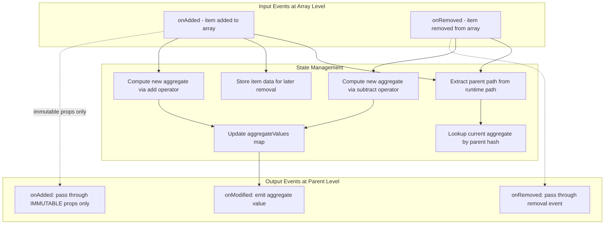

# `commutativeAggregate` Operation Design

## Executive Summary

This document provides a detailed design for the `commutativeAggregate` operation, which computes aggregate values (sum, count, min, max, etc.) over arrays at a specific nested path level. The aggregate can be updated incrementally as items are added or removed, making it efficient for large datasets.

---

## 1. TypeScript Interface Design

### 1.1 Operator Function Types

The `add` and `subtract` operators define how the aggregate is computed incrementally:

```typescript
/**
 * Operator called when an item is added to the aggregated array.
 * 
 * @param currentAggregate - The current aggregate value, or undefined if this is the first item
 * @param item - The immutable properties of the item being added
 * @returns The new aggregate value
 */
type AddOperator<TItem, TAggregate> = (
    currentAggregate: TAggregate | undefined,
    item: TItem
) => TAggregate;

/**
 * Operator called when an item is removed from the aggregated array.
 * 
 * @param currentAggregate - The current aggregate value (never undefined since an item must exist to be removed)
 * @param item - The immutable properties of the item being removed
 * @returns The new aggregate value
 */
type SubtractOperator<TItem, TAggregate> = (
    currentAggregate: TAggregate,
    item: TItem
) => TAggregate;
```

### 1.2 Configuration Options

```typescript
/**
 * Configuration for the commutative aggregate operation.
 */
interface CommutativeAggregateConfig<TItem, TAggregate> {
    /** Operator called when an item is added */
    add: AddOperator<TItem, TAggregate>;
    
    /** Operator called when an item is removed */
    subtract: SubtractOperator<TItem, TAggregate>;
}
```

### 1.3 The Step Interface

```typescript
import type { AddedHandler, ModifiedHandler, RemovedHandler, Step, TypeDescriptor } from '../pipeline';

/**
 * A step that computes an aggregate value over items in a nested array.
 *
 * This step:
 * 1. Registers for add/remove events at the target array level
 * 2. Maintains aggregate state keyed by parent path
 * 3. Emits onModified events when the aggregate changes
 * 4. Transforms the type by replacing the array with the aggregate property
 *
 * **IMPORTANT: Event Channel Separation**
 * - `onAdded`/`onRemoved` pass through immutable properties ONLY (no aggregate)
 * - `onModified` is the ONLY channel for communicating aggregate values
 * - This follows the system pattern: mutable/computed properties use onModified
 *
 * @template TItem - The type of items in the array being aggregated
 * @template TAggregate - The type of the aggregate value
 * @template TPath - The tuple of array names forming the path to the target array
 * @template TPropName - The name of the new aggregate property
 */
class CommutativeAggregateStep<
    TItem extends {},
    TAggregate,
    TPath extends string[],
    TPropName extends string
> implements Step {
    
    /** Maps parent path hash to current aggregate value */
    private aggregateValues: Map<string, TAggregate> = new Map();
    
    /** Maps parent path hash to item key -> item data for removal lookup */
    private itemsByParent: Map<string, Map<string, TItem>> = new Map();
    
    /** Handlers for modified events at the parent level */
    private modifiedHandlers: Array<{
        pathNames: string[];
        handler: ModifiedHandler;
    }> = [];
    
    constructor(
        private input: Step,
        private arrayPath: TPath,
        private propertyName: TPropName,
        private config: CommutativeAggregateConfig<TItem, TAggregate>
    ) {
        // Implementation registers handlers with input step
    }
    
    getTypeDescriptor(): TypeDescriptor {
        // Returns modified descriptor with array removed at target level
    }
    
    onAdded(pathNames: string[], handler: AddedHandler): void {
        // Routes added events at parent level with IMMUTABLE properties only
        // Does NOT include the aggregate value (aggregate is mutable)
    }
    
    onRemoved(pathNames: string[], handler: RemovedHandler): void {
        // Routes removed events
    }
    
    onModified(pathNames: string[], handler: ModifiedHandler): void {
        // Registers handlers for aggregate property changes
        // This is the ONLY channel for communicating aggregate values
    }
}
```

---

## 2. Type Transformation Logic

### 2.1 Navigating to a Nested Array Level

Given a type `T` and a path `['employees', 'tasks']`, we need to:
1. Navigate into the `employees` array
2. Navigate into the `tasks` array within each employee
3. Return the item type of `tasks`

```typescript
import { KeyedArray } from './builder';

/**
 * Extracts the item type from a KeyedArray.
 */
type KeyedArrayItem<T> = T extends KeyedArray<infer U> ? U : never;

/**
 * Navigates through a type following a path of array property names.
 * Returns the item type of the final array in the path.
 * 
 * @example
 * type Input = {
 *   department: string;
 *   employees: KeyedArray<{
 *     name: string;
 *     tasks: KeyedArray<{ taskId: string; hours: number }>
 *   }>
 * };
 * 
 * type Result = NavigateToArrayItem<Input, ['employees', 'tasks']>;
 * // Result = { taskId: string; hours: number }
 */
type NavigateToArrayItem<T, Path extends string[]> = 
    Path extends [infer First extends string, ...infer Rest extends string[]]
        ? First extends keyof T
            ? T[First] extends KeyedArray<infer ItemType>
                ? Rest extends []
                    ? ItemType  // Reached the target array
                    : NavigateToArrayItem<ItemType, Rest>  // Continue navigating
                : never  // Property is not an array
            : never  // Property doesn't exist
        : never;  // Empty path

/**
 * Gets the parent type that contains the target array.
 * For path ['employees', 'tasks'], returns the type containing 'tasks'.
 * 
 * @example
 * type Input = {
 *   department: string;
 *   employees: KeyedArray<{
 *     name: string;
 *     tasks: KeyedArray<{ taskId: string; hours: number }>
 *   }>
 * };
 * 
 * type Result = NavigateToParent<Input, ['employees', 'tasks']>;
 * // Result = { name: string; tasks: KeyedArray<{ taskId: string; hours: number }> }
 */
type NavigateToParent<T, Path extends string[]> = 
    Path extends [infer First extends string, ...infer Rest extends string[]]
        ? First extends keyof T
            ? T[First] extends KeyedArray<infer ItemType>
                ? Rest extends [string]
                    ? ItemType  // Next is the last array, so current item is parent
                    : Rest extends [string, ...string[]]
                        ? NavigateToParent<ItemType, Rest>  // Continue navigating
                        : never
                : never
            : never
        : T;  // Empty path means T itself is the parent
```

### 2.2 Event Type vs Output Type

**Important Distinction:**

The `commutativeAggregate` operation produces two different views of the type:

1. **Immutable Type (for `onAdded`/`onRemoved`)**: The parent type with the array removed, but WITHOUT the aggregate property. This is because aggregates are mutable/computed values.

2. **Output Type (full type)**: The parent type with the array replaced by the aggregate property. This represents the complete logical structure.

The aggregate value is communicated ONLY via `onModified` events, not through `onAdded`.

### 2.3 Computing the Output Type

The output type transformation must:
1. Find the parent type containing the target array
2. Remove the array property from the parent
3. Add the new aggregate property to the parent (delivered via `onModified`)

```typescript
/**
 * Gets the last element of a tuple type.
 */
type LastElement<T extends string[]> = 
    T extends [...infer Rest, infer Last extends string] 
        ? Last 
        : never;

/**
 * Gets all elements except the last from a tuple type.
 */
type AllButLast<T extends string[]> = 
    T extends [...infer Rest extends string[], string] 
        ? Rest 
        : never;

/**
 * Replaces an array property with an aggregate property at a specific level.
 * 
 * @template T - The parent type containing the array
 * @template ArrayName - The name of the array property to remove
 * @template PropName - The name of the new aggregate property
 * @template TAggregate - The type of the aggregate value
 */
type ReplaceArrayWithAggregate<
    T,
    ArrayName extends string,
    PropName extends string,
    TAggregate
> = Omit<T, ArrayName> & Record<PropName, TAggregate>;

/**
 * Transforms the output type by navigating to the parent level and
 * replacing the target array with the aggregate property.
 * 
 * @template T - The input type
 * @template Path - The path to the target array
 * @template PropName - The name of the new aggregate property
 * @template TAggregate - The type of the aggregate value
 */
type TransformWithAggregate<
    T,
    Path extends string[],
    PropName extends string,
    TAggregate
> = Path extends [infer ArrayName extends string]
    // Single-level path: replace directly in T
    ? ReplaceArrayWithAggregate<T, ArrayName, PropName, TAggregate>
    // Multi-level path: navigate and transform recursively
    : Path extends [infer First extends string, ...infer Rest extends string[]]
        ? First extends keyof T
            ? T[First] extends KeyedArray<infer ItemType>
                ? Omit<T, First> & {
                    [K in First]: KeyedArray<
                        TransformWithAggregate<ItemType, Rest & string[], PropName, TAggregate>
                    >
                }
                : never
            : never
        : never;
```

### 2.4 Type Transformation Examples

#### Example 1: Single-Level Path

**Input Type:**
```typescript
type Input = {
    category: string;
    items: KeyedArray<{ name: string; price: number }>;
};
```

**Operation:** `.commutativeAggregate(['items'], 'totalPrice', add, subtract)`

**Output Type:**
```typescript
type Output = {
    category: string;
    totalPrice: number;  // The aggregate type inferred from add/subtract
};
```

#### Example 2: Two-Level Path

**Input Type:**
```typescript
type Input = {
    department: string;
    employees: KeyedArray<{
        name: string;
        tasks: KeyedArray<{
            taskId: string;
            hours: number;
        }>;
    }>;
};
```

**Operation:** `.commutativeAggregate(['employees', 'tasks'], 'totalHours', add, subtract)`

**Output Type:**
```typescript
type Output = {
    department: string;
    employees: KeyedArray<{
        name: string;
        totalHours: number;  // Replaces tasks array
    }>;
};
```

#### Example 3: Three-Level Path

**Input Type:**
```typescript
type Input = {
    region: string;
    stores: KeyedArray<{
        storeId: string;
        departments: KeyedArray<{
            deptName: string;
            products: KeyedArray<{
                sku: string;
                inventory: number;
            }>;
        }>;
    }>;
};
```

**Operation:** `.commutativeAggregate(['stores', 'departments', 'products'], 'totalInventory', add, subtract)`

**Output Type:**
```typescript
type Output = {
    region: string;
    stores: KeyedArray<{
        storeId: string;
        departments: KeyedArray<{
            deptName: string;
            totalInventory: number;  // Replaces products array
        }>;
    }>;
};
```

---

## 3. API Design

### 3.1 Builder Method Signature

```typescript
// Added to PipelineBuilder class
class PipelineBuilder<TStart, T extends {}> {
    // ... existing methods ...
    
    /**
     * Computes an aggregate value over items in a nested array.
     * 
     * The aggregate is computed incrementally as items are added or removed.
     * The target array is replaced with the aggregate property in the output type.
     * 
     * @param arrayPath - Path of array names to navigate to the target array
     * @param propertyName - Name of the new aggregate property
     * @param add - Operator called when an item is added
     * @param subtract - Operator called when an item is removed
     * 
     * @example
     * // Sum of hours across all tasks for each employee
     * .commutativeAggregate(
     *     ['employees', 'tasks'],
     *     'totalHours',
     *     (acc, task) => (acc ?? 0) + task.hours,
     *     (acc, task) => acc - task.hours
     * )
     */
    commutativeAggregate<
        Path extends ValidArrayPath<T>,
        PropName extends string,
        TAggregate
    >(
        arrayPath: Path,
        propertyName: PropName,
        add: AddOperator<NavigateToArrayItem<T, Path>, TAggregate>,
        subtract: SubtractOperator<NavigateToArrayItem<T, Path>, TAggregate>
    ): PipelineBuilder<TStart, TransformWithAggregate<T, Path, PropName, TAggregate>>;
}
```

### 3.2 Path Validation Type

To provide IDE autocompletion and type safety for array paths:

```typescript
/**
 * Generates all valid array paths through a type.
 * Each path is a tuple of property names that lead through nested KeyedArrays.
 */
type ValidArrayPath<T, Prefix extends string[] = []> = 
    T extends object
        ? {
            [K in keyof T]: T[K] extends KeyedArray<infer ItemType>
                ? [...Prefix, K & string] | ValidArrayPath<ItemType, [...Prefix, K & string]>
                : never
        }[keyof T]
        : never;
```

**Usage Example:**
```typescript
type Input = {
    department: string;
    employees: KeyedArray<{
        name: string;
        tasks: KeyedArray<{ taskId: string; hours: number }>;
    }>;
};

type Paths = ValidArrayPath<Input>;
// Paths = ['employees'] | ['employees', 'tasks']
```

### 3.3 Complete Usage Examples

#### Example 1: Simple Sum Aggregate

```typescript
const [pipeline, getOutput] = createTestPipeline(() =>
    createPipeline<{ category: string; itemName: string; price: number }>()
        .groupBy(['category'], 'items')
        .commutativeAggregate(
            ['items'],
            'totalPrice',
            (acc, item) => (acc ?? 0) + item.price,
            (acc, item) => acc - item.price
        )
);

pipeline.add('item1', { category: 'Electronics', itemName: 'Phone', price: 500 });
pipeline.add('item2', { category: 'Electronics', itemName: 'Laptop', price: 1200 });

const output = getOutput();
// output = [{ category: 'Electronics', totalPrice: 1700 }]

pipeline.remove('item1');
// output = [{ category: 'Electronics', totalPrice: 1200 }]
```

**Event Flow for this example:**
- When 'item1' is added:
  1. `onAdded` at root: `{ category: 'Electronics' }` (immutable props only, NO totalPrice)
  2. `onModified` at root: `totalPrice = 500` (aggregate delivered separately)
- When 'item2' is added:
  1. `onModified` at root: `totalPrice = 1700` (aggregate updated)
- When 'item1' is removed:
  1. `onModified` at root: `totalPrice = 1200` (aggregate updated)

#### Example 2: Nested Aggregate with Count

```typescript
const [pipeline, getOutput] = createTestPipeline(() =>
    createPipeline<{ 
        state: string; 
        city: string; 
        venue: string; 
        capacity: number 
    }>()
        .groupBy(['state', 'city'], 'venues')
        .groupBy(['state'], 'cities')
        .commutativeAggregate(
            ['cities', 'venues'],
            'venueCount',
            (acc, _venue) => (acc ?? 0) + 1,
            (acc, _venue) => acc - 1
        )
);

pipeline.add('v1', { state: 'TX', city: 'Dallas', venue: 'Arena', capacity: 20000 });
pipeline.add('v2', { state: 'TX', city: 'Dallas', venue: 'Stadium', capacity: 50000 });
pipeline.add('v3', { state: 'TX', city: 'Houston', venue: 'Center', capacity: 18000 });

const output = getOutput();
// output = [{
//   state: 'TX',
//   cities: [
//     { city: 'Dallas', venueCount: 2 },
//     { city: 'Houston', venueCount: 1 }
//   ]
// }]
```

#### Example 3: Handler Registration Pattern

This example shows how to correctly register handlers to receive aggregate values:

```typescript
const step = pipeline.getStep();

// Register for immutable properties (category)
step.onAdded([], (path, key, props) => {
    // props = { category: 'Electronics' }
    // NOTE: totalPrice is NOT included here - it's mutable
    console.log(`Category added: ${props.category}`);
});

// Register for aggregate value updates
step.onModified([], (path, key, propName, value) => {
    if (propName === 'totalPrice') {
        // This is the ONLY way to receive aggregate updates
        console.log(`Total price updated to: ${value}`);
    }
});
```

#### Example 4: Complex Aggregate Min/Max

```typescript
interface MinMax {
    min: number;
    max: number;
}

const [pipeline, getOutput] = createTestPipeline(() =>
    createPipeline<{ category: string; product: string; rating: number }>()
        .groupBy(['category'], 'products')
        .commutativeAggregate<['products'], 'ratingRange', MinMax>(
            ['products'],
            'ratingRange',
            (acc, product) => ({
                min: Math.min(acc?.min ?? Infinity, product.rating),
                max: Math.max(acc?.max ?? -Infinity, product.rating)
            }),
            (acc, _product) => {
                // Note: For min/max, removal requires recalculation
                // This is a limitation of commutative aggregates
                // A full aggregate would be needed for proper min/max removal
                return acc; // Simplified - doesn't handle removal correctly
            }
        )
);
```

---

## 4. State Management Design

### 4.1 Internal State Structure

The step maintains two maps keyed by the **parent path hash**:

```typescript
class CommutativeAggregateStep<TItem, TAggregate, TPath, TPropName> {
    /**
     * Maps parent path hash to current aggregate value.
     * The parent path is everything except the item's own key.
     * 
     * Example: For path ['cities', 'venues'] and runtime path ['hash_TX', 'hash_Dallas', 'v1']:
     * - Parent path is ['hash_TX', 'hash_Dallas']
     * - Parent hash is computed from ['hash_TX', 'hash_Dallas']
     */
    private aggregateValues: Map<string, TAggregate> = new Map();
    
    /**
     * Maps parent path hash to (item key -> item data).
     * Used to lookup item data during removal.
     * 
     * Example: itemsByParent.get('hash_TX_hash_Dallas').get('v1') 
     *          returns { venue: 'Arena', capacity: 20000 }
     */
    private itemsByParent: Map<string, Map<string, TItem>> = new Map();
}
```

### 4.2 Computing Parent Path

```typescript
/**
 * Computes the parent path from a full runtime path.
 * The parent path excludes the item's own key.
 * 
 * @param fullPath - Full runtime path including item key
 * @returns Parent path (all but the last element)
 */
function getParentPath(fullPath: string[]): string[] {
    return fullPath.slice(0, -1);
}

/**
 * Computes a hash key for a path (for map lookups).
 */
function computePathHash(path: string[]): string {
    return path.join('::');
}
```

### 4.3 Event Flow Diagram

The following diagram shows how events flow through the aggregate step. Note the key distinction:
- **Immutable properties** flow through `onAdded`/`onRemoved`
- **Aggregate values** flow ONLY through `onModified`



**Key Insight:** When a downstream consumer registers for `onAdded` at the parent level:
- They receive only the immutable properties of the parent
- They do NOT receive the aggregate value in the `onAdded` payload
- They must register for `onModified` to receive aggregate updates

### 4.4 Handler Registration Logic

**Critical Design Decision:** The aggregate value is NOT included in `onAdded` payloads. Aggregates are mutable/computed values and are communicated ONLY via `onModified`.

```typescript
onAdded(pathNames: string[], handler: AddedHandler): void {
    if (this.isParentPath(pathNames)) {
        // Handler wants events at the parent level (where aggregate lives)
        // Pass through ONLY immutable properties - do NOT inject aggregate
        const parentPathInInput = this.getInputParentPath(pathNames);
        this.input.onAdded(parentPathInInput, (path, key, immutableProps) => {
            // Pass through immutable properties ONLY
            // Aggregate value is NOT included - it's delivered via onModified
            handler(path, key, immutableProps);
        });
    } else if (this.isBelowTargetArray(pathNames)) {
        // Handler wants events below the target array
        // These are blocked - the array no longer exists in output
        throw new Error(
            `Cannot register handler at path ${pathNames.join('.')} - ` +
            `array ${this.arrayPath[this.arrayPath.length - 1]} has been aggregated`
        );
    } else {
        // Handler wants events at unrelated path - pass through
        this.input.onAdded(pathNames, handler);
    }
}

onModified(pathNames: string[], handler: ModifiedHandler): void {
    if (this.isParentPath(pathNames)) {
        // Handler wants modification events at parent level
        // This is the ONLY channel for receiving aggregate values
        const parentPathInInput = this.getInputParentPath(pathNames);
        
        // Store handler to call when aggregate changes
        // This handler will receive the aggregate property updates
        this.modifiedHandlers.push({
            pathNames: parentPathInInput,
            handler
        });
        
        // Also pass through to input for other property modifications
        this.input.onModified(parentPathInInput, handler);
    } else {
        this.input.onModified(pathNames, handler);
    }
}
```

**Why this matters:**
- Immutable properties are set once when an item is added and never change
- Aggregates are computed values that change every time an item is added/removed
- By separating these channels, consumers can efficiently handle both cases:
  - `onAdded`: Create UI elements, allocate resources, etc.
  - `onModified`: Update displayed values without recreating structures

### 4.5 TypeDescriptor Transformation

The `TypeDescriptor` must be updated to remove the target array from the tree:

```typescript
getTypeDescriptor(): TypeDescriptor {
    const inputDescriptor = this.input.getTypeDescriptor();
    return this.transformDescriptor(inputDescriptor, this.arrayPath);
}

private transformDescriptor(
    descriptor: TypeDescriptor, 
    remainingPath: string[]
): TypeDescriptor {
    if (remainingPath.length === 0) {
        return descriptor;
    }
    
    const [currentArrayName, ...restPath] = remainingPath;
    
    if (restPath.length === 0) {
        // This is the target array - remove it from the descriptor
        return {
            arrays: descriptor.arrays.filter(a => a.name !== currentArrayName)
        };
    }
    
    // Navigate deeper
    return {
        arrays: descriptor.arrays.map(arrayDesc => {
            if (arrayDesc.name === currentArrayName) {
                return {
                    name: arrayDesc.name,
                    type: this.transformDescriptor(arrayDesc.type, restPath)
                };
            }
            return arrayDesc;
        })
    };
}
```

### 4.6 Handling Item Addition

```typescript
private handleItemAdded(runtimePath: string[], itemKey: string, item: TItem): void {
    const parentPath = getParentPath(runtimePath);
    const parentHash = computePathHash(parentPath);
    
    // Store item for later removal
    if (!this.itemsByParent.has(parentHash)) {
        this.itemsByParent.set(parentHash, new Map());
    }
    this.itemsByParent.get(parentHash)!.set(itemKey, item);
    
    // Compute new aggregate
    const currentAggregate = this.aggregateValues.get(parentHash);
    const newAggregate = this.config.add(currentAggregate, item);
    this.aggregateValues.set(parentHash, newAggregate);
    
    // Emit modification event
    const parentKey = parentPath[parentPath.length - 1];
    const pathToParent = parentPath.slice(0, -1);
    
    this.modifiedHandlers.forEach(({ handler }) => {
        handler(pathToParent, parentKey, this.propertyName, newAggregate);
    });
}
```

### 4.7 Handling Item Removal

```typescript
private handleItemRemoved(runtimePath: string[], itemKey: string): void {
    const parentPath = getParentPath(runtimePath);
    const parentHash = computePathHash(parentPath);
    
    // Lookup stored item data
    const parentItems = this.itemsByParent.get(parentHash);
    if (!parentItems) {
        throw new Error(`No items tracked for parent ${parentHash}`);
    }
    
    const item = parentItems.get(itemKey);
    if (!item) {
        throw new Error(`Item ${itemKey} not found in parent ${parentHash}`);
    }
    
    // Remove from tracking
    parentItems.delete(itemKey);
    if (parentItems.size === 0) {
        this.itemsByParent.delete(parentHash);
    }
    
    // Compute new aggregate
    const currentAggregate = this.aggregateValues.get(parentHash);
    if (currentAggregate === undefined) {
        throw new Error(`No aggregate value for parent ${parentHash}`);
    }
    
    const newAggregate = this.config.subtract(currentAggregate, item);
    
    // Update or remove aggregate based on whether items remain
    if (parentItems?.size ?? 0 > 0) {
        this.aggregateValues.set(parentHash, newAggregate);
    } else {
        this.aggregateValues.delete(parentHash);
    }
    
    // Emit modification event
    const parentKey = parentPath[parentPath.length - 1];
    const pathToParent = parentPath.slice(0, -1);
    
    this.modifiedHandlers.forEach(({ handler }) => {
        handler(pathToParent, parentKey, this.propertyName, newAggregate);
    });
}
```

---

## 5. Edge Cases and Considerations

### 5.1 Empty Arrays and Initial State

- When the first item is added to a parent, the aggregate starts as `undefined`
- The `add` operator must handle `currentAggregate: undefined`
- When all items are removed, the aggregate value is removed from the map

### 5.2 Parent Creation/Removal

- When a parent is created (e.g., a new group), the aggregate property should be `undefined` until items are added
- When a parent is removed, all associated aggregate state is cleaned up

### 5.3 Non-Commutative Operations

This design assumes commutative operations (order-independent). Operations like min/max that cannot be decremented properly on removal would need a different approach:
- Option A: Track all values and recompute on removal
- Option B: Document this limitation

### 5.4 Memory Management

- The `itemsByParent` map stores all item data for removal lookups
- For very large datasets, this could consume significant memory
- Consider adding an option for "add-only" aggregates that don't support removal

---

## 6. File Structure

```
src/
├── steps/
│   └── commutative-aggregate.ts    # New step implementation
├── builder.ts                       # Add commutativeAggregate method
├── pipeline.ts                      # No changes needed
└── test/
    └── pipeline.commutative-aggregate.test.ts  # New tests
```

---

## 7. Summary of Key Design Decisions

| Decision | Rationale |
|----------|-----------|
| **Path as string array** | Matches existing `pathNames` pattern in pipeline architecture |
| **Separate add/subtract operators** | Enables efficient incremental updates without full recomputation |
| **`undefined` initial aggregate** | Allows operators to distinguish first item from subsequent adds |
| **State keyed by parent path hash** | Enables O(1) lookup of aggregate state |
| **Store item data for removal** | Required to call subtract operator with original item data |
| **Remove array from TypeDescriptor** | Downstream steps won't see the aggregated array |
| **Aggregate via `onModified` ONLY** | Aggregates are mutable/computed values, not immutable properties |
| **`onAdded` excludes aggregate** | Follows system pattern: immutable props in `onAdded`, mutable in `onModified` |

---

## 8. Next Steps

1. **Implement `CommutativeAggregateStep`** in `src/steps/commutative-aggregate.ts`
2. **Add builder method** with type transformations to `src/builder.ts`
3. **Write comprehensive tests** for various scenarios
4. **Document edge cases** and limitations