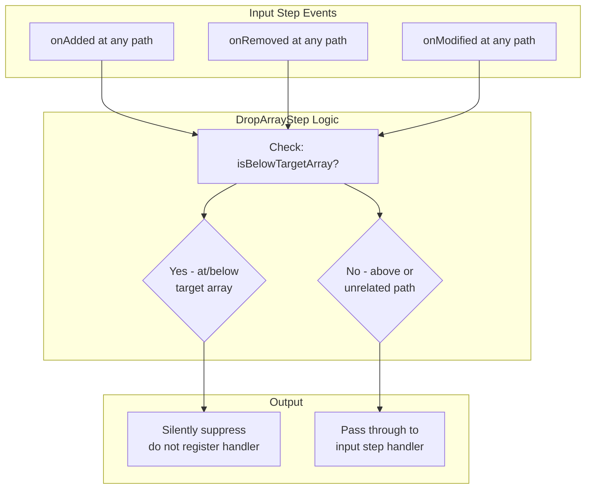

# `DropArrayStep` Design Document

## Executive Summary

This document outlines the design for separating the `CommutativeAggregateStep` into two distinct responsibilities:

1. **`CommutativeAggregateStep`** - Computes mutable aggregate properties from array items; keeps the array in the output
2. **`DropArrayStep`** - Removes an array from the output type descriptor and suppresses events at or below that array

This separation follows the Single Responsibility Principle and enables more flexible pipeline composition.

---

## 1. Problem Statement

### Current Implementation Issues

The current [`CommutativeAggregateStep`](../src/steps/commutative-aggregate.ts) does two logically separate things:

1. **Aggregation**: Computes a mutable property from array items (e.g., sum, count)
2. **Array removal**: Removes the source array from the type descriptor and suppresses events

This coupling creates several problems:

- Cannot compute an aggregate while still keeping the array visible
- Cannot drop an array without computing an aggregate
- Harder to test each responsibility independently
- Less composable - users cannot mix and match behaviors

### Code Analysis

**Array removal logic** (to be extracted to `DropArrayStep`):

| Location | Purpose |
|----------|---------|
| Lines 104-133: [`transformDescriptor()`](../src/steps/commutative-aggregate.ts:104) | Filters out the target array from the TypeDescriptor |
| Lines 197-204: [`isBelowTargetArray()`](../src/steps/commutative-aggregate.ts:197) | Helper to detect paths at or below target array |
| Lines 136,139-145: [`onAdded()`](../src/steps/commutative-aggregate.ts:135) | Suppresses events below target array |
| Lines 149,152-155: [`onRemoved()`](../src/steps/commutative-aggregate.ts:148) | Suppresses events below target array |
| Lines 161,172-175: [`onModified()`](../src/steps/commutative-aggregate.ts:161) | Suppresses events below target array |

**Aggregate computation logic** (to remain in `CommutativeAggregateStep`):

| Location | Purpose |
|----------|---------|
| Lines 72-75: State maps | `aggregateValues`, `itemStore` for tracking state |
| Lines 90-96: Constructor | Registering for array item add/remove events |
| Lines 209-246: [`handleItemAdded()`](../src/steps/commutative-aggregate.ts:209) | Compute aggregate on add, emit onModified |
| Lines 251-305: [`handleItemRemoved()`](../src/steps/commutative-aggregate.ts:251) | Compute aggregate on remove, emit onModified |

---

## 2. `DropArrayStep` Interface Design

### 2.1 Constructor Signature

```typescript
/**
 * A step that removes an array from the output type descriptor
 * and suppresses all events at or below that array path.
 *
 * @template TInput - The input type containing the array to drop
 * @template TPath - The tuple of array names forming the path to the target array
 */
export class DropArrayStep<
    TInput,
    TPath extends string[]
> implements Step {
    
    constructor(
        private input: Step,
        private arrayPath: TPath
    ) {
        // No event handlers to register - this step only filters
    }
}
```

### 2.2 Method Signatures

```typescript
interface Step {
    /**
     * Returns the type descriptor with the target array removed.
     */
    getTypeDescriptor(): TypeDescriptor;
    
    /**
     * Registers an added handler if the path is NOT at or below the target array.
     * Paths at or below the target array are silently ignored (suppressed).
     */
    onAdded(pathNames: string[], handler: AddedHandler): void;
    
    /**
     * Registers a removed handler if the path is NOT at or below the target array.
     * Paths at or below the target array are silently ignored (suppressed).
     */
    onRemoved(pathNames: string[], handler: RemovedHandler): void;
    
    /**
     * Registers a modified handler if the path is NOT at or below the target array.
     * Paths at or below the target array are silently ignored (suppressed).
     */
    onModified(pathNames: string[], handler: ModifiedHandler): void;
}
```

---

## 3. Type Transformation

### 3.1 TypeDescriptor Transformation

The `getTypeDescriptor()` method must recursively navigate the descriptor tree and remove the target array:

```typescript
getTypeDescriptor(): TypeDescriptor {
    const inputDescriptor = this.input.getTypeDescriptor();
    return this.transformDescriptor(inputDescriptor, [...this.arrayPath]);
}

private transformDescriptor(
    descriptor: TypeDescriptor, 
    remainingPath: string[]
): TypeDescriptor {
    if (remainingPath.length === 0) {
        // No more path to navigate - return unchanged
        return descriptor;
    }
    
    const [currentArrayName, ...restPath] = remainingPath;
    
    if (restPath.length === 0) {
        // This is the target array - remove it from the descriptor
        return {
            arrays: descriptor.arrays.filter(a => a.name !== currentArrayName)
        };
    }
    
    // Navigate deeper into the tree
    return {
        arrays: descriptor.arrays.map(arrayDesc => {
            if (arrayDesc.name === currentArrayName) {
                return {
                    name: arrayDesc.name,
                    type: this.transformDescriptor(arrayDesc.type, restPath)
                };
            }
            return arrayDesc;
        })
    };
}
```

### 3.2 TypeScript Output Type

The builder will need a type utility to compute the output type:

```typescript
/**
 * Removes an array from a type at the specified path.
 * 
 * @example
 * type Input = {
 *   state: string;
 *   cities: KeyedArray<{
 *     city: string;
 *     venues: KeyedArray<{ name: string; capacity: number }>;
 *   }>;
 * };
 * 
 * type Output = DropArrayFromType<Input, ['cities', 'venues']>;
 * // Output = {
 * //   state: string;
 * //   cities: KeyedArray<{ city: string }>;  // venues removed
 * // }
 */
type DropArrayFromType<T, Path extends string[]> = 
    Path extends [infer First extends string]
        // Single-level path: remove the array property directly
        ? Omit<T, First>
        // Multi-level path: navigate and transform recursively
        : Path extends [infer First extends string, ...infer Rest extends string[]]
            ? First extends keyof T
                ? T[First] extends KeyedArray<infer ItemType>
                    ? Omit<T, First> & {
                        [K in First]: KeyedArray<
                            DropArrayFromType<ItemType, Rest & string[]>
                        >
                    }
                    : never
                : never
            : T;
```

---

## 4. Event Suppression Logic

### 4.1 Path Detection Helper

```typescript
/**
 * Checks if a path is at or below the target array.
 * 
 * @param pathNames - The path being checked (e.g., ['cities', 'venues'])
 * @returns true if the path starts with the arrayPath (at or below target)
 * 
 * @example
 * // arrayPath = ['cities', 'venues']
 * isBelowTargetArray(['cities']) -> false         // above target
 * isBelowTargetArray(['cities', 'venues']) -> true  // at target
 * isBelowTargetArray(['cities', 'venues', 'staff']) -> true  // below target
 * isBelowTargetArray(['stores']) -> false         // unrelated
 */
private isBelowTargetArray(pathNames: string[]): boolean {
    // Path must be at least as long as arrayPath to be at or below
    if (pathNames.length < this.arrayPath.length) {
        return false;
    }
    
    // Check if pathNames starts with arrayPath
    return this.arrayPath.every((name, i) => pathNames[i] === name);
}
```

### 4.2 Event Handler Routing

Each event handler method follows the same pattern:

```typescript
onAdded(pathNames: string[], handler: AddedHandler): void {
    if (this.isBelowTargetArray(pathNames)) {
        // Path is at or below the dropped array
        // Silently suppress - do not register handler
        return;
    }
    
    // Path is above or unrelated to the dropped array
    // Pass through to input step
    this.input.onAdded(pathNames, handler);
}

onRemoved(pathNames: string[], handler: RemovedHandler): void {
    if (this.isBelowTargetArray(pathNames)) {
        // Suppress events at or below the dropped array
        return;
    }
    
    this.input.onRemoved(pathNames, handler);
}

onModified(pathNames: string[], handler: ModifiedHandler): void {
    if (this.isBelowTargetArray(pathNames)) {
        // Suppress events at or below the dropped array
        return;
    }
    
    this.input.onModified(pathNames, handler);
}
```

### 4.3 Event Flow Diagram



---

## 5. Changes to `CommutativeAggregateStep`

### 5.1 Code to Remove

The following code should be removed from `CommutativeAggregateStep`:

1. **`transformDescriptor()` method** (lines 104-133) - No longer needed
2. **`isBelowTargetArray()` method** (lines 197-204) - Moved to `DropArrayStep`
3. **Event suppression logic** in `onAdded`, `onRemoved`, `onModified` - No longer needed

### 5.2 Simplified Implementation

After removal, `CommutativeAggregateStep` becomes simpler:

```typescript
export class CommutativeAggregateStep<
    TInput,
    TPath extends string[],
    TPropertyName extends string,
    TAggregate
> implements Step {
    
    private aggregateValues: Map<string, TAggregate> = new Map();
    private itemStore: Map<string, ImmutableProps> = new Map();
    private modifiedHandlers: ModifiedHandler[] = [];
    
    constructor(
        private input: Step,
        private arrayPath: TPath,
        private propertyName: TPropertyName,
        private config: CommutativeAggregateConfig<ImmutableProps, TAggregate>
    ) {
        // Register for array item events
        this.input.onAdded(this.arrayPath, (path, key, immutableProps) => {
            this.handleItemAdded(path, key, immutableProps);
        });
        
        this.input.onRemoved(this.arrayPath, (path, key) => {
            this.handleItemRemoved(path, key);
        });
    }
    
    getTypeDescriptor(): TypeDescriptor {
        // Pass through unchanged - array is still present
        return this.input.getTypeDescriptor();
    }
    
    onAdded(pathNames: string[], handler: AddedHandler): void {
        // Pass through unchanged - array is still present
        this.input.onAdded(pathNames, handler);
    }
    
    onRemoved(pathNames: string[], handler: RemovedHandler): void {
        // Pass through unchanged - array is still present
        this.input.onRemoved(pathNames, handler);
    }
    
    onModified(pathNames: string[], handler: ModifiedHandler): void {
        // Register for aggregate property modifications at parent level
        const parentPath = this.arrayPath.slice(0, -1);
        
        if (pathNames.length === parentPath.length && 
            pathNames.every((name, i) => name === parentPath[i])) {
            // Handler is at the parent level where aggregate property lives
            this.modifiedHandlers.push(handler);
        }
        
        // Always pass through to input for other modifications
        this.input.onModified(pathNames, handler);
    }
    
    // handleItemAdded and handleItemRemoved remain unchanged
    // ... (lines 209-305 stay the same)
}
```

---

## 6. Composition Pattern

### 6.1 Typical Usage

With the separation, pipelines can compose these operations:

```typescript
// Compute aggregate AND drop the array (current behavior)
createPipeline<{ state: string; city: string; venue: string; capacity: number }>()
    .groupBy(['state', 'city'], 'venues')
    .groupBy(['state'], 'cities')
    .commutativeAggregate(
        ['cities', 'venues'],
        'venueCount',
        (acc, _) => (acc ?? 0) + 1,
        (acc, _) => acc - 1
    )
    .dropArray(['cities', 'venues'])  // NEW: explicit array removal

// Compute aggregate but KEEP the array visible
createPipeline<{ state: string; city: string; venue: string; capacity: number }>()
    .groupBy(['state', 'city'], 'venues')
    .groupBy(['state'], 'cities')
    .commutativeAggregate(
        ['cities', 'venues'],
        'venueCount',
        (acc, _) => (acc ?? 0) + 1,
        (acc, _) => acc - 1
    )
    // No dropArray - venues array remains in output!

// Drop an array without computing an aggregate
createPipeline<{ a: string; b: string; c: string }>()
    .groupBy(['a', 'b'], 'items')
    .groupBy(['a'], 'groups')
    .dropArray(['groups', 'items'])  // Remove items, keep groups
```

### 6.2 Builder API

```typescript
class PipelineBuilder<TStart, T extends {}> {
    /**
     * Removes an array from the output type.
     * Events at or below this array path will be suppressed.
     * 
     * @param arrayPath - Path to the array to remove
     */
    dropArray<Path extends ValidArrayPath<T>>(
        arrayPath: Path
    ): PipelineBuilder<TStart, DropArrayFromType<T, Path>> {
        const step = new DropArrayStep(this.lastStep, arrayPath);
        return new PipelineBuilder(this.input, step);
    }
}
```

---

## 7. Edge Cases and Considerations

### 7.1 Order of Operations

The order of `commutativeAggregate` and `dropArray` matters:

```typescript
// CORRECT: Aggregate first, then drop
.commutativeAggregate(['items'], 'total', add, subtract)
.dropArray(['items'])

// ERROR: Cannot aggregate a dropped array
.dropArray(['items'])
.commutativeAggregate(['items'], 'total', add, subtract)  // Error: 'items' doesn't exist
```

### 7.2 Nested Array Paths

When dropping an array at a nested path, only that specific array is removed:

```typescript
// Starting type after groupBy operations:
// {
//   regions: KeyedArray<{
//     states: KeyedArray<{
//       cities: KeyedArray<{ name: string }>
//     }>
//   }>
// }

.dropArray(['regions', 'states', 'cities'])

// Result type:
// {
//   regions: KeyedArray<{
//     states: KeyedArray<{}>  // cities removed, but states remains
//   }>
// }
```

### 7.3 Multiple Aggregates on Same Array

With separation, you can compute multiple aggregates before dropping:

```typescript
.commutativeAggregate(['items'], 'totalPrice', sumPrice, subtractPrice)
.commutativeAggregate(['items'], 'itemCount', countAdd, countSub)
.dropArray(['items'])

// Output has both totalPrice and itemCount properties
```

### 7.4 Event Timing

Since `DropArrayStep` suppresses events rather than filtering data:
- Events for items in the dropped array never reach downstream handlers
- This is more efficient than allowing events to propagate and then filtering

### 7.5 Empty Parent After Drop

When an array is dropped, the parent object still exists but may have no arrays:

```typescript
// Before drop:
{ city: 'Dallas', venues: KeyedArray<...> }

// After .dropArray(['venues']):
{ city: 'Dallas' }  // Parent still exists, just without the array
```

---

## 8. Implementation Checklist

### Phase 1: Create `DropArrayStep`

- [ ] Create `src/steps/drop-array.ts`
- [ ] Implement `DropArrayStep` class with:
  - [ ] `getTypeDescriptor()` - transform descriptor to remove array
  - [ ] `isBelowTargetArray()` - path detection helper
  - [ ] `onAdded()` - suppress events at/below target
  - [ ] `onRemoved()` - suppress events at/below target
  - [ ] `onModified()` - suppress events at/below target

### Phase 2: Add Builder Method

- [ ] Add `DropArrayFromType<T, Path>` type utility to builder
- [ ] Add `ValidArrayPath<T>` type validation
- [ ] Add `dropArray()` method to `PipelineBuilder`
- [ ] Export from `index.ts`

### Phase 3: Modify `CommutativeAggregateStep`

- [ ] Remove `transformDescriptor()` method
- [ ] Remove `isBelowTargetArray()` method
- [ ] Simplify `onAdded()` to pass through
- [ ] Simplify `onRemoved()` to pass through
- [ ] Simplify `onModified()` - keep aggregate handler registration, pass through others
- [ ] Update `getTypeDescriptor()` to pass through unchanged

### Phase 4: Update Tests

- [ ] Create `src/test/pipeline.drop-array.test.ts`
- [ ] Test type descriptor transformation
- [ ] Test event suppression for added/removed/modified
- [ ] Test nested array paths
- [ ] Update existing aggregate tests to use explicit `dropArray()`

---

## 9. File Structure

```
src/
├── steps/
│   ├── commutative-aggregate.ts  # Simplified - aggregate only
│   ├── drop-array.ts             # NEW - array removal
│   ├── drop-property.ts
│   ├── define-property.ts
│   └── group-by.ts
├── builder.ts                     # Add dropArray method
├── pipeline.ts                    # No changes
├── index.ts                       # Export DropArrayStep
└── test/
    ├── pipeline.drop-array.test.ts        # NEW
    └── pipeline.commutative-aggregate.test.ts  # Update
```

---

## 10. Summary

| Aspect | `CommutativeAggregateStep` (After) | `DropArrayStep` (New) |
|--------|-----------------------------------|----------------------|
| **Purpose** | Compute mutable aggregate property | Remove array from output |
| **State** | `aggregateValues`, `itemStore` maps | None (stateless) |
| **TypeDescriptor** | Pass through unchanged | Transform to remove array |
| **onAdded** | Pass through | Suppress at/below target |
| **onRemoved** | Pass through | Suppress at/below target |
| **onModified** | Register aggregate handlers, pass through | Suppress at/below target |
| **Output array** | Array remains visible | Array removed |

This separation enables more flexible composition and cleaner, more testable code.