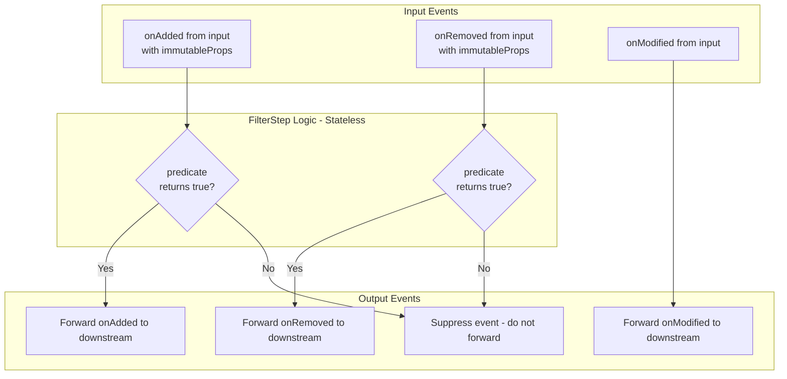

# `filter` Pipeline Builder Function Design

## Executive Summary

This document provides a detailed design for the `filter` operation, which filters out objects that do not match a given predicate condition. Items that fail the predicate are excluded from the pipeline output, while items that pass are forwarded unchanged. The operation integrates seamlessly with the existing pipeline builder pattern and supports scoped filtering via the `in()` method.

---

## 1. Overview and Purpose

### 1.1 What is `filter`?

The `filter` operation is analogous to JavaScript's `Array.prototype.filter()` - it selectively passes through only those items that satisfy a given predicate function. Unlike array filtering which creates a new array, this pipeline filter:

- Intercepts `onAdded` events and only forwards those that match the predicate
- Tracks which items were added to properly handle removals
- Does not modify the type structure - filtered items have the same shape as input items

### 1.2 Use Cases

1. **Excluding inactive records**: Filter out items where `status !== 'active'`
2. **Threshold filtering**: Only include items where `value > threshold`
3. **Conditional aggregation**: Filter before grouping or aggregating
4. **Scoped filtering**: Filter items within nested arrays using `in()`

---

## 2. API Design

### 2.1 Basic Function Signature

```typescript
filter<T>(
    predicate: (item: NavigateToPath<T, Path>) => boolean
): PipelineBuilder<T, TStart, Path>
```

**Key characteristics:**
- Takes a predicate function that receives the item at the current scope path
- Returns a `PipelineBuilder` with the **same type** (filtering doesn't change shape)
- The predicate is evaluated once when an item is added

### 2.2 Builder Method Integration

```typescript
class PipelineBuilder<T extends {}, TStart, Path extends string[] = []> {
    /**
     * Filters items at the current scope path based on a predicate.
     * Only items for which the predicate returns `true` are included in the output.
     * 
     * The filter is evaluated when items are added to the pipeline.
     * Items that fail the predicate are excluded entirely - they do not appear
     * in the output and their add/remove/modify events are not forwarded.
     * 
     * @param predicate - Function that returns true for items to include
     * @returns A PipelineBuilder with the same type (filtering preserves type shape)
     * 
     * @example
     * // Filter at root level - only include active items
     * createPipeline<{ status: string; value: number }>()
     *     .filter(item => item.status === 'active')
     * 
     * @example
     * // Filter within a nested array using in()
     * createPipeline<{ category: string; price: number }>()
     *     .groupBy(['category'], 'items')
     *     .in('items').filter(item => item.price > 100)
     * 
     * @example
     * // Combine with other operations
     * createPipeline<{ type: string; amount: number }>()
     *     .filter(item => item.type === 'credit')
     *     .groupBy(['type'], 'transactions')
     *     .sum('transactions', 'amount', 'totalAmount')
     */
    filter(
        predicate: (item: NavigateToPath<T, Path>) => boolean
    ): PipelineBuilder<T, TStart, Path>;
}
```

### 2.3 Usage Examples

#### Example 1: Simple Root-Level Filter

```typescript
const [pipeline, getOutput] = createTestPipeline(() =>
    createPipeline<{ status: string; name: string; value: number }>()
        .filter(item => item.status === 'active')
);

pipeline.add('item1', { status: 'active', name: 'Alice', value: 100 });
pipeline.add('item2', { status: 'inactive', name: 'Bob', value: 200 });
pipeline.add('item3', { status: 'active', name: 'Carol', value: 150 });

const output = getOutput();
// output = [
//   { status: 'active', name: 'Alice', value: 100 },
//   { status: 'active', name: 'Carol', value: 150 }
// ]
// Bob's item is excluded because status !== 'active'
```

#### Example 2: Filter Before GroupBy

```typescript
const [pipeline, getOutput] = createTestPipeline(() =>
    createPipeline<{ category: string; price: number; inStock: boolean }>()
        .filter(item => item.inStock)  // Only include items in stock
        .groupBy(['category'], 'items')
        .sum('items', 'price', 'totalInStock')
);

pipeline.add('p1', { category: 'Electronics', price: 500, inStock: true });
pipeline.add('p2', { category: 'Electronics', price: 300, inStock: false });
pipeline.add('p3', { category: 'Electronics', price: 200, inStock: true });

const output = getOutput();
// output = [{ category: 'Electronics', totalInStock: 700 }]
// The $300 item is excluded from the sum because inStock is false
```

#### Example 3: Scoped Filter with `in()`

```typescript
const [pipeline, getOutput] = createTestPipeline(() =>
    createPipeline<{ department: string; employee: string; salary: number }>()
        .groupBy(['department'], 'employees')
        .in('employees').filter(emp => emp.salary >= 50000)  // Filter within each department
        .count('employees', 'highEarnerCount')
);

pipeline.add('e1', { department: 'Engineering', employee: 'Alice', salary: 80000 });
pipeline.add('e2', { department: 'Engineering', employee: 'Bob', salary: 45000 });
pipeline.add('e3', { department: 'Engineering', employee: 'Carol', salary: 75000 });

const output = getOutput();
// output = [{ department: 'Engineering', highEarnerCount: 2 }]
// Bob is excluded from the count because salary < 50000
```

#### Example 4: Multiple Filters

```typescript
const [pipeline, getOutput] = createTestPipeline(() =>
    createPipeline<{ type: string; amount: number; verified: boolean }>()
        .filter(item => item.verified)
        .filter(item => item.amount > 0)
        .groupBy(['type'], 'transactions')
);

// Both filters are applied - only verified items with positive amounts pass through
```

#### Example 5: Filter with Removal

```typescript
const [pipeline, getOutput] = createTestPipeline(() =>
    createPipeline<{ status: string; value: number }>()
        .filter(item => item.status === 'active')
);

pipeline.add('item1', { status: 'active', value: 100 });
pipeline.add('item2', { status: 'inactive', value: 200 });
pipeline.add('item3', { status: 'active', value: 150 });

expect(getOutput().length).toBe(2);  // item1 and item3

pipeline.remove('item1');  // Removal of filtered item works correctly
expect(getOutput().length).toBe(1);  // Only item3 remains

pipeline.remove('item2');  // Removal of excluded item is a no-op
expect(getOutput().length).toBe(1);  // Still only item3
```

---

## 3. Type Signature Details

### 3.1 Type Preservation

Unlike operations that add or remove properties (like `defineProperty` or `dropProperty`), filtering preserves the exact type:

```typescript
// Input type
type Input = { category: string; value: number; active: boolean };

// After filter - SAME type
type AfterFilter = { category: string; value: number; active: boolean };
```

This is different from operations like `groupBy` which transform the type:

```typescript
// groupBy changes: Input -> { category: string; items: KeyedArray<{ value: number; active: boolean }> }
```

### 3.2 Full Type Signature

```typescript
filter(
    predicate: (item: NavigateToPath<T, Path>) => boolean
): PipelineBuilder<T, TStart, Path>
```

Where:
- `T` - The current pipeline type
- `TStart` - The original input type (preserved for `build()`)
- `Path` - The current scope path from `in()` calls
- `NavigateToPath<T, Path>` - The type at the current scope level

### 3.3 Type Examples

```typescript
// Root level filter
createPipeline<{ a: number; b: string }>()
    .filter(item => item.a > 0)
// T = { a: number; b: string }
// Path = []
// predicate receives: { a: number; b: string }
// returns: PipelineBuilder<{ a: number; b: string }, { a: number; b: string }, []>

// Scoped filter
createPipeline<{ category: string; value: number }>()
    .groupBy(['category'], 'items')
    .in('items').filter(item => item.value > 100)
// T = { category: string; items: KeyedArray<{ value: number }> }
// Path = ['items']
// predicate receives: { value: number }
// returns: PipelineBuilder<{ category: string; items: KeyedArray<{ value: number }> }, ...>
```

---

## 4. Immutability Analysis and Design Simplification

### 4.1 The Key Insight

**User Question**: "Given that the properties passed to the `added` handler are immutable, do we need to store the added keys to protect the downstream `removed` handlers?"

This question led to a significant architectural improvement. The answer is **no** - we don't need per-step state tracking because `immutableProps` are now available during removal events.

### 4.2 Handler Signatures (Implemented)

From [`src/pipeline.ts`](src/pipeline.ts:19):

```typescript
export type AddedHandler = (path: string[], key: string, immutableProps: ImmutableProps) => void;
export type RemovedHandler = (path: string[], key: string, immutableProps: ImmutableProps) => void;
export type ModifiedHandler = (path: string[], key: string, name: string, value: any) => void;
```

**Key decision**: The `RemovedHandler` now receives `immutableProps`, matching the `AddedHandler` signature. This architectural change (documented in [`docs/removed-handler-immutable-props-design.md`](removed-handler-immutable-props-design.md)) enables stateless step implementations.

### 4.3 Historical Context: Why State Tracking Was Originally Considered

An earlier design considered tracking `addedKeys: Set<string>` because:

1. `onRemoved` originally only received `(path, key)` - not `immutableProps`
2. Without the item data, we could not re-evaluate the predicate
3. We needed to know if the item was forwarded downstream to decide whether to forward the removal

This approach was rejected in favor of the API change that adds `immutableProps` to `RemovedHandler`.

### 4.4 The Immutability Guarantee

The key insight is that **items are immutable**. This means:

- The predicate result is **deterministic** - evaluating it at removal time yields the same result as at addition time
- With access to `immutableProps` during removal, we can simply re-evaluate the predicate
- **No state tracking is needed**

### 4.5 Implemented Design: Stateless FilterStep

With the API change implemented (see [`docs/removed-handler-immutable-props-design.md`](removed-handler-immutable-props-design.md)), `FilterStep` is **stateless**:

```typescript
class FilterStep<T> implements Step {
    // No state needed!
    
    onAdded(pathNames: string[], handler: AddedHandler): void {
        this.input.onAdded(pathNames, (path, key, immutableProps) => {
            if (this.predicate(immutableProps as T)) {
                handler(path, key, immutableProps);
            }
        });
    }
    
    onRemoved(pathNames: string[], handler: RemovedHandler): void {
        this.input.onRemoved(pathNames, (path, key, immutableProps) => {
            // Re-evaluate predicate - result is deterministic for immutable data!
            if (this.predicate(immutableProps as T)) {
                handler(path, key, immutableProps);
            }
        });
    }
}
```

**Benefits of this approach:**
- ✅ No per-step state needed
- ✅ Simpler implementation
- ✅ Consistent with other simplified aggregate steps
- ✅ Centralized item storage in `InputPipeline`

### 4.6 Architecture Summary

| Aspect | Implementation |
|--------|---------------|
| Handler signature | `RemovedHandler` includes `immutableProps` |
| FilterStep state | None - stateless |
| Item storage location | Centralized in `InputPipeline` |
| Memory efficiency | Single copy of items |
| Determinism | Explicit - predicate re-evaluated on removal |

### 4.7 Design Decision: Stateless Implementation

**The stateless design was chosen as the architectural approach.**

The implementation centralizes item storage at the pipeline input level:

1. **[`RemovedHandler`](src/pipeline.ts:21) signature** includes `immutableProps` ✅
2. **[`InputPipeline`](src/factory.ts:6)** stores items and passes them during removal ✅
3. **`FilterStep`** - no state tracking needed ✅
4. **Aggregate steps** simplified - `itemStore` removed ✅

This centralizes item storage at the pipeline input level rather than duplicating it across multiple steps.

---

## 5. Step Implementation Architecture (Stateless Design)

### 5.1 FilterStep Class Structure

```typescript
import type { AddedHandler, ImmutableProps, RemovedHandler, ModifiedHandler, Step, TypeDescriptor } from '../pipeline';
import { pathsMatch } from '../util/path';

/**
 * A step that filters items based on a predicate function.
 *
 * This step:
 * 1. Intercepts `onAdded` events at the scope path
 * 2. Evaluates the predicate for each item
 * 3. Only forwards events for items that pass the predicate
 * 4. Re-evaluates the predicate on removal (stateless design)
 *
 * NOTE: This design requires RemovedHandler to include immutableProps.
 */
export class FilterStep<T> implements Step {
    // No state needed - stateless design!
    
    constructor(
        private input: Step,
        private predicate: (item: T) => boolean,
        private scopePath: string[]
    ) {}
    
    getTypeDescriptor(): TypeDescriptor {
        // Filter does not modify the type structure
        return this.input.getTypeDescriptor();
    }
    
    onAdded(pathNames: string[], handler: AddedHandler): void {
        // Implementation details in section 5.3
    }
    
    onRemoved(pathNames: string[], handler: RemovedHandler): void {
        // Implementation details in section 5.4
    }
    
    onModified(pathNames: string[], handler: ModifiedHandler): void {
        // Implementation details in section 5.5
    }
    
    private isAtScopePath(pathNames: string[]): boolean {
        return pathsMatch(pathNames, this.scopePath);
    }
}
```

### 5.2 State Management

**The stateless `FilterStep` maintains no state.**

This is possible because:
1. Items are immutable - predicate results are deterministic
2. `RemovedHandler` receives `immutableProps` - we can re-evaluate the predicate
3. The same logic applies to `onModified` - we can check the predicate on the item

### 5.3 `onAdded` Handler Logic

```typescript
onAdded(pathNames: string[], handler: AddedHandler): void {
    if (this.isAtScopePath(pathNames)) {
        // Register intercepting handler with input
        this.input.onAdded(pathNames, (path, key, immutableProps) => {
            // Evaluate predicate
            if (this.predicate(immutableProps as T)) {
                // Item passes filter - forward
                handler(path, key, immutableProps);
            }
            // Item fails filter - do not forward
        });
    } else {
        // Not at scope path - pass through unchanged
        this.input.onAdded(pathNames, handler);
    }
}
```

### 5.4 `onRemoved` Handler Logic

```typescript
onRemoved(pathNames: string[], handler: RemovedHandler): void {
    if (this.isAtScopePath(pathNames)) {
        // Register intercepting handler with input
        // NOTE: Requires updated RemovedHandler signature with immutableProps
        this.input.onRemoved(pathNames, (path, key, immutableProps) => {
            // Re-evaluate predicate - same result as at add time due to immutability
            if (this.predicate(immutableProps as T)) {
                handler(path, key, immutableProps);
            }
            // Item was filtered out on add - ignore removal
        });
    } else {
        // Not at scope path - pass through unchanged
        this.input.onRemoved(pathNames, handler);
    }
}
```

### 5.5 `onModified` Handler Logic

```typescript
onModified(pathNames: string[], handler: ModifiedHandler): void {
    if (this.isAtScopePath(pathNames)) {
        // For modifications, we need a way to check the predicate
        // Option 1: Store items (adds state, defeats purpose)
        // Option 2: Accept that modifications inherently need context
        //
        // Recommended: Pass through modifications at scope path
        // The downstream steps already have the item if it was added
        // If the item was filtered out, no handlers exist downstream
        this.input.onModified(pathNames, handler);
    } else {
        // Not at scope path - pass through unchanged
        this.input.onModified(pathNames, handler);
    }
}
```

**Note on `onModified`**: Modifications are tricky in a fully stateless design. However, since modifications only occur on items that were previously added, and the downstream step only registers handlers for items that passed the filter, modifications for filtered-out items simply have no registered handlers to call. The pass-through approach works correctly.

### 5.6 Event Flow Diagram (Stateless Design)



---

## 6. API Implementation Reference

### 6.1 RemovedHandler Signature (Implemented)

In [`src/pipeline.ts`](src/pipeline.ts:21):

```typescript
export type RemovedHandler = (path: string[], key: string, immutableProps: ImmutableProps) => void;
```

This matches the `AddedHandler` signature, providing symmetry in the API.

### 6.2 InputPipeline Item Storage (Implemented)

In [`src/factory.ts`](src/factory.ts:6), the `InputPipeline` class stores items:

```typescript
class InputPipeline<T> implements Pipeline<T>, Step {
    private addedHandlers: AddedHandler[] = [];
    private removedHandlers: RemovedHandler[] = [];
    private items: Map<string, T> = new Map();  // Stores items for removal

    add(key: string, immutableProps: T): void {
        this.items.set(key, immutableProps);  // Store for later removal
        this.addedHandlers.forEach(handler => handler([], key, immutableProps as ImmutableProps));
    }

    remove(key: string): void {
        const immutableProps = this.items.get(key);
        if (immutableProps !== undefined) {
            this.items.delete(key);
            this.removedHandlers.forEach(handler => handler([], key, immutableProps as ImmutableProps));
        }
    }
    // ... rest unchanged
}
```

### 6.3 Impact on Steps (Implemented)

All steps that handle `onRemoved` events now receive `immutableProps`:

- **[`GroupByStep`](src/steps/group-by.ts)**: Receives and forwards `immutableProps`
- **[`CommutativeAggregateStep`](src/steps/commutative-aggregate.ts)**: Uses passed `immutableProps`, no `itemStore` needed
- **`FilterStep`**: Stateless implementation, re-evaluates predicate using `immutableProps`

For full details on the API change, see [`docs/removed-handler-immutable-props-design.md`](removed-handler-immutable-props-design.md).

---

## 7. Integration with Existing Pipeline Builder

### 7.1 Builder Method Addition

Add the `filter` method to `PipelineBuilder` in [`src/builder.ts`](src/builder.ts:74):

```typescript
class PipelineBuilder<T extends {}, TStart, Path extends string[] = []> {
    // ... existing methods ...
    
    filter(
        predicate: (item: NavigateToPath<T, Path>) => boolean
    ): PipelineBuilder<T, TStart, Path> {
        const newStep = new FilterStep<NavigateToPath<T, Path>>(
            this.lastStep,
            predicate as (item: unknown) => boolean,
            this.scopePath as string[]
        );
        return new PipelineBuilder(this.input, newStep, this.scopePath) as any;
    }
}
```

### 7.2 Step File Location

Create new file: `src/steps/filter.ts`

### 7.3 Export Updates

Update [`src/index.ts`](src/index.ts:1) to export the new step:

```typescript
// Filter step (for advanced usage)
export { FilterStep } from './steps/filter';
```

---

## 8. Edge Cases and Considerations

### 6.1 Empty Result Set

When all items fail the predicate, the output is an empty array:

```typescript
const [pipeline, getOutput] = createTestPipeline(() =>
    createPipeline<{ value: number }>()
        .filter(item => item.value > 1000)
);

pipeline.add('item1', { value: 100 });
pipeline.add('item2', { value: 200 });

const output = getOutput();
// output = [] - all items filtered out
```

### 6.2 Predicate Exceptions

If the predicate throws an exception:

```typescript
.filter(item => {
    if (item.value === null) throw new Error('Null value!');
    return item.value > 0;
})
```

**Design Decision**: Let the exception propagate. The predicate is user-provided code, and exceptions should be visible to help debugging. The step should not silently swallow errors.

### 6.3 Interaction with GroupBy

When `filter` is used before `groupBy`:

```typescript
createPipeline<{ category: string; active: boolean }>()
    .filter(item => item.active)
    .groupBy(['category'], 'items')
```

- Only active items are grouped
- Group keys may differ from what they would be without the filter
- Empty groups (all items filtered) won't appear

When `filter` is used after `groupBy` with `in()`:

```typescript
createPipeline<{ category: string; active: boolean }>()
    .groupBy(['category'], 'items')
    .in('items').filter(item => item.active)
```

- Groups are still created for all category values
- Items within groups are filtered
- Groups may contain empty `items` arrays

### 6.4 Filter and Aggregates

When filtering before aggregation:

```typescript
createPipeline<{ type: string; amount: number }>()
    .filter(item => item.amount > 0)
    .groupBy(['type'], 'transactions')
    .sum('transactions', 'amount', 'positiveTotal')
```

- Only positive amounts contribute to the sum
- The aggregate correctly updates when items are added/removed

### 6.5 Multiple Filters in Sequence

Multiple filters can be chained:

```typescript
.filter(item => item.active)
.filter(item => item.value > 100)
```

This is equivalent to:

```typescript
.filter(item => item.active && item.value > 100)
```

Both forms work correctly. Chained filters may be slightly less efficient but more readable.

### 6.6 Nested Filters at Different Levels

Filters can be applied at different nesting levels:

```typescript
createPipeline<{ region: string; city: string; population: number }>()
    .filter(item => item.population > 10000)  // Filter before grouping
    .groupBy(['region'], 'cities')
    .in('cities').filter(city => city.city.startsWith('New'))  // Filter within groups
```

Both filters work independently at their respective scope paths.

### 6.7 Filter with Item Removal

When an item that was filtered out is removed:

```typescript
pipeline.add('item1', { active: false });  // Filtered out
pipeline.remove('item1');  // No-op - item was never "added" from pipeline's perspective
```

The removal is silently ignored because the item was never forwarded downstream.

### 8.8 Immutability Guarantee and Stateless Design

With the stateless design, the filter predicate is evaluated **twice**:
1. When an item is added - to decide whether to forward
2. When an item is removed - to decide whether to forward the removal

**This is safe because items are immutable.** The predicate result is deterministic - the same input always produces the same output.

This aligns with the pipeline's immutability model:
- `onAdded` delivers immutable properties
- `onRemoved` delivers the same immutable properties (with API change)
- `onModified` delivers mutable/computed property changes
- Filter evaluates against immutable properties at both add and remove time

---

## 9. Architectural Decisions and Rationale

| Decision | Rationale |
|----------|-----------|
| **Type preservation** | Filter does not change the shape of items, only their count. This is intuitive and matches Array.filter behavior. |
| **Predicate function** | Functions are the most flexible way to express conditions. Object-based conditions like MongoDB queries could be added later as syntactic sugar. |
| **Stateless design** | By passing `immutableProps` in `RemovedHandler`, we eliminate per-step state tracking. This is enabled by the immutability guarantee. |
| **Re-evaluate predicate on removal** | Since items are immutable, re-evaluation is deterministic. This simplifies the implementation and centralizes item storage. |
| **Pass through at non-scope paths** | Follows existing pattern from [`DefinePropertyStep`](src/steps/define-property.ts) and [`DropPropertyStep`](src/steps/drop-property.ts). Filters only affect items at their scope level. |
| **Let predicate exceptions propagate** | User code should fail visibly. Silent failure would make debugging harder. |
| **Centralized item storage** | Moving item storage to `InputPipeline` eliminates duplication across steps like `CommutativeAggregateStep` and `FilterStep`. |
| **Support in scoping** | Enables powerful nested filtering patterns consistent with other operations. |

---

## 10. Test Cases to Implement

### 10.1 Basic Functionality

1. Filter includes matching items
2. Filter excludes non-matching items
3. Filter handles empty input
4. Filter handles all items matching
5. Filter handles no items matching

### 10.2 Item Removal

6. Removal of matched item works correctly
7. Removal of filtered-out item is no-op
8. Removal order doesn't matter

### 10.3 Integration with Other Operations

9. Filter before groupBy
10. Filter after groupBy with in()
11. Filter before sum/count aggregates
12. Multiple chained filters
13. Filter combined with defineProperty
14. Filter combined with dropProperty

### 10.4 Scoped Filtering

15. Filter at root level (empty scope path)
16. Filter at first nesting level
17. Filter at deeply nested level
18. Multiple filters at different nesting levels

### 10.5 Edge Cases

19. Predicate that throws exception
20. Predicate with complex logic
21. Filter with boolean property shortcuts

---

## 11. Future Enhancements

### 11.1 Object-Based Predicates (Optional Syntax Sugar)

```typescript
// Future: MongoDB-style query object
.filter({ status: 'active', value: { $gt: 100 } })

// Compiles to:
.filter(item => item.status === 'active' && item.value > 100)
```

### 11.2 Async Predicates (Not Recommended)

Async predicates would complicate the event-driven model. If needed, filtering should be done at the data source level before items enter the pipeline.

### 11.3 Dynamic Filtering (Advanced)

A hypothetical "reactive filter" that re-evaluates when external state changes. This would require significant architecture changes and is out of scope for the initial implementation.

---

## 12. File Structure Summary

```
src/
├── builder.ts                     # Add filter() method
├── steps/
│   └── filter.ts                  # New FilterStep implementation
├── index.ts                       # Export FilterStep
└── test/
    └── pipeline.filter.test.ts    # Comprehensive tests
```

---

## 13. Implementation Status

The prerequisite API changes have been completed:

1. ✅ **Updated `RemovedHandler` signature** in [`src/pipeline.ts`](src/pipeline.ts:21)
2. ✅ **Updated `InputPipeline`** in [`src/factory.ts`](src/factory.ts:6) to store and pass items
3. ✅ **Updated existing steps** that forward removal events (e.g., [`GroupByStep`](src/steps/group-by.ts))
4. ✅ **Simplified aggregate steps** to use passed `immutableProps`

**Remaining for FilterStep:**
5. ⏳ **Implement `FilterStep`** with the stateless design
6. ⏳ **Add comprehensive tests**

See [`docs/removed-handler-immutable-props-design.md`](removed-handler-immutable-props-design.md) for details on the completed API changes.

---

## 14. Summary

The `filter` operation provides a clean, type-safe way to exclude items from a pipeline based on a predicate function. Following the decision to add `immutableProps` to `RemovedHandler`, the design uses a stateless approach:

- **Stateless implementation** - No `addedKeys` tracking needed due to immutability
- **Preserves type shape** - Output type matches input type
- **Supports scoping** - Works with `in()` for nested filtering
- **Handles removals correctly** - Re-evaluates predicate using passed `immutableProps`
- **Integrates seamlessly** - Follows existing patterns for step implementation
- **Is composable** - Works well with groupBy, aggregates, and other operations

**Architectural decision**: By passing `immutableProps` in `RemovedHandler` (see [`docs/removed-handler-immutable-props-design.md`](removed-handler-immutable-props-design.md)), individual steps like `FilterStep` can be stateless. The predicate result is deterministic for immutable data, so re-evaluation at removal time yields the same result as at addition time.

This approach centralizes item storage at the pipeline input level and eliminates duplicated state management across multiple steps, resulting in a cleaner and more maintainable architecture.

### Immutable Properties Available in Remove Handlers

When implementing `FilterStep`, the `onRemoved` handler receives:
- `path: string[]` - The path to the item
- `key: string` - The unique key of the item
- `immutableProps: ImmutableProps` - All properties that were passed when the item was added

This enables the stateless re-evaluation of the filter predicate during removal events.