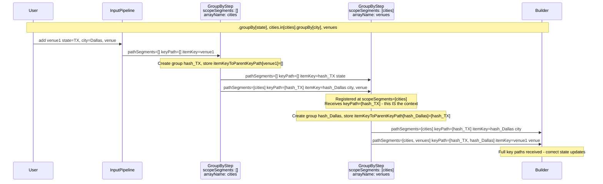

# `in()` Path Prefix Design Document

> **Status: ✅ IMPLEMENTED** - All 98 tests pass as of November 2024

## Executive Summary

This document describes the design for an `in()` prefix function that allows builder functions like `groupBy` to be applied at a specific depth within the aggregation tree. This enables more intuitive and flexible pipeline composition when working with nested data structures.

---

## 1. Problem Statement and Motivation

### 1.1 Current Patterns

Currently, operations that need to work at a specific path depth must either:

1. **Chain multiple groupBy operations** - Each `groupBy` naturally creates nested structure, but subsequent groupBy operations always apply at the root level of their input:

```typescript
createPipeline<{ state: string, city: string, town: string, population: number }>()
    .groupBy(['state', 'city'], 'towns')   // First groupBy creates structure
    .groupBy(['state'], 'cities')          // Second groupBy groups the result
```

2. **Use explicit path arrays** - Operations like `commutativeAggregate` accept an explicit path array:

```typescript
.commutativeAggregate(
    ['cities', 'venues'],  // Path to the target array
    'total',
    add,
    subtract
)
```

### 1.2 Limitations

The current approach has several limitations:

1. **Implicit nesting only** - When you want to group items within an already-nested array, you must rely on the implicit behavior where properties "flow through" the groupBy chain

2. **No explicit scoping** - There's no way to explicitly say "apply this operation within this path context"

3. **Complex mental model** - Understanding how nested groupBy operations interact requires understanding the internal event routing mechanism

### 1.3 Proposed Solution

Introduce an `in()` prefix function that explicitly scopes subsequent operations to a specific path:

```typescript
// Instead of relying on implicit groupBy chaining behavior:
.groupBy(['state', 'city'], 'towns')
.groupBy(['state'], 'cities')

// Enable explicit scoping for operations within nested arrays:
.groupBy(['state'], 'cities')
.in('cities').groupBy(['city'], 'towns')  // Apply groupBy within each city
```

---

## 2. API Design

### 2.1 Basic Syntax

The `in()` function accepts a variadic list of path segments and returns a scoped builder:

```typescript
in(...pathSegments: string[]): ScopedBuilder<TStart, TScoped>
```

**Examples:**

```typescript
// Single path segment
.in('cities').groupBy(['city'], 'venues')

// Multiple path segments (nested access)
.in('cities', 'venues').defineProperty('formattedName', v => v.name.toUpperCase())

// Variadic syntax
const path = ['cities', 'venues'];
.in(...path).groupBy(['venueId'], 'events')
```

### 2.2 Supported Operations

The scoped builder returned by `in()` should support all operations that make sense within a scoped context:

| Operation | Example | Description |
|-----------|---------|-------------|
| `groupBy` | `.in('cities').groupBy(['city'], 'venues')` | Group items within the scoped array |
| `defineProperty` | `.in('cities').defineProperty('label', ...)` | Add computed property to items at path |
| `dropProperty` | `.in('cities').dropProperty('temp')` | Remove property from items at path |
| `commutativeAggregate` | `.in('cities').commutativeAggregate('venues', ...)` | Aggregate array within scoped context |
| `dropArray` | `.in('cities').dropArray('venues')` | Drop array within scoped context |

**Note:** With the normalized API, `dropArray` and `commutativeAggregate` take just the array **name** (e.g., `'venues'`), not a path array. The scope context from `in()` provides the path prefix.

### 2.3 Complete Usage Examples

#### Example 1: Nested GroupBy with Explicit Scoping

```typescript
createPipeline<{ state: string, city: string, venue: string, capacity: number }>()
    .groupBy(['state'], 'cities')
    .in('cities').groupBy(['city'], 'venues')
```

**Result Type:**
```typescript
{
    state: string;
    cities: KeyedArray<{
        city: string;
        venues: KeyedArray<{
            venue: string;
            capacity: number;
        }>;
    }>;
}
```

#### Example 2: Deep Nesting

```typescript
createPipeline<{ region: string, state: string, city: string, venue: string, event: string }>()
    .groupBy(['region'], 'states')
    .in('states').groupBy(['state'], 'cities')
    .in('states', 'cities').groupBy(['city'], 'venues')
    .in('states', 'cities', 'venues').groupBy(['venue'], 'events')
```

#### Example 3: Mixed Operations at Different Depths

```typescript
createPipeline<{ category: string, product: string, sku: string, price: number }>()
    .groupBy(['category'], 'products')
    .in('products').groupBy(['product'], 'skus')
    // Add aggregate at the products level (skus array name, not path)
    .in('products').commutativeAggregate(
        'skus',  // Just the array name
        'skuCount',
        (acc, _) => (acc ?? 0) + 1,
        (acc, _) => acc - 1
    )
    // Add computed property at the skus level
    .in('products', 'skus').defineProperty('priceFormatted', sku => `$${sku.price.toFixed(2)}`)
```

#### Example 4: Aggregate and Drop Within Scope

```typescript
createPipeline<{ department: string, employee: string, task: string, hours: number }>()
    .groupBy(['department'], 'employees')
    .in('employees').groupBy(['employee'], 'tasks')
    // Aggregate tasks for each employee
    .in('employees').commutativeAggregate(
        'tasks',  // Just the array name
        'totalHours',
        (acc, task) => (acc ?? 0) + task.hours,
        (acc, task) => acc - task.hours
    )
    // Drop the tasks array to keep only the aggregate
    .in('employees').dropArray('tasks')  // Just the array name
```

---

## 3. Type System Design

### 3.1 Core Type Utilities

#### 3.1.1 Navigate to Path Item Type

```typescript
import { KeyedArray } from './builder';

/**
 * Navigates through a type following a variadic path of array property names.
 * Returns the item type at the final path.
 * 
 * @example
 * type Input = {
 *   state: string;
 *   cities: KeyedArray<{
 *     city: string;
 *     venues: KeyedArray<{ name: string }>
 *   }>;
 * };
 * 
 * NavigateToPath<Input, ['cities']> = { city: string; venues: KeyedArray<{ name: string }> }
 * NavigateToPath<Input, ['cities', 'venues']> = { name: string }
 */
type NavigateToPath<T, Path extends string[]> =
    Path extends [infer First extends string, ...infer Rest extends string[]]
        ? First extends keyof T
            ? T[First] extends KeyedArray<infer ItemType>
                ? Rest extends []
                    ? ItemType
                    : NavigateToPath<ItemType, Rest>
                : never
            : never
        : T;
```

#### 3.1.2 Validate Path Exists

```typescript
/**
 * Validates that a path is valid for a given type.
 * Returns the path if valid, never otherwise.
 */
type ValidatePath<T, Path extends string[]> =
    Path extends [infer First extends string, ...infer Rest extends string[]]
        ? First extends keyof T
            ? T[First] extends KeyedArray<infer ItemType>
                ? Rest extends []
                    ? Path
                    : Rest extends string[]
                        ? ValidatePath<ItemType, Rest> extends never
                            ? never
                            : Path
                        : never
                : never
            : never
        : [];
```

#### 3.1.3 Transform Nested Type

```typescript
/**
 * Transforms the type at a specific path while preserving the parent structure.
 * Used when operations modify types at a nested level.
 * 
 * @template T - The root type
 * @template Path - The path to the transformation point
 * @template Transform - A type function to apply at the path
 */
type TransformAtPath<T, Path extends string[], NewItemType> =
    Path extends [infer First extends string, ...infer Rest extends string[]]
        ? First extends keyof T
            ? T[First] extends KeyedArray<infer ItemType>
                ? Rest extends []
                    // Replace the array item type
                    ? Omit<T, First> & { [K in First]: KeyedArray<NewItemType> }
                    // Recurse into nested structure
                    : Omit<T, First> & { 
                        [K in First]: KeyedArray<TransformAtPath<ItemType, Rest & string[], NewItemType>>
                      }
                : never
            : never
        : NewItemType;
```

### 3.2 ScopedBuilder Interface

```typescript
/**
 * A builder that operates within a scoped path context.
 * Operations modify types at the scoped depth while preserving ancestor structure.
 */
interface ScopedBuilder<TStart, TRoot, TScoped extends {}, Path extends string[]> {
    /**
     * Groups items by key properties, creating a nested array.
     * Applied within the current scope.
     */
    groupBy<K extends keyof TScoped, ArrayName extends string>(
        groupingProperties: K[],
        arrayName: ArrayName
    ): PipelineBuilder<TStart, TransformAtPath<TRoot, Path, {
        [P in K]: TScoped[P]
    } & {
        [P in ArrayName]: KeyedArray<{
            [Q in Exclude<keyof TScoped, K>]: TScoped[Q]
        }>
    }>>;
    
    /**
     * Defines a computed property on items at the scoped path.
     */
    defineProperty<PropName extends string, PropType>(
        propertyName: PropName,
        compute: (item: TScoped) => PropType
    ): PipelineBuilder<TStart, TransformAtPath<TRoot, Path, TScoped & Record<PropName, PropType>>>;
    
    /**
     * Drops a property from items at the scoped path.
     */
    dropProperty<K extends keyof TScoped>(
        propertyName: K
    ): PipelineBuilder<TStart, TransformAtPath<TRoot, Path, Omit<TScoped, K>>>;
    
    /**
     * Computes an aggregate over a nested array within the scope.
     * Takes just the array name - the scope provides the path prefix.
     */
    commutativeAggregate<
        ArrayName extends keyof TScoped & string,
        PropName extends string,
        TAggregate
    >(
        arrayName: ArrayName,
        propertyName: PropName,
        add: AddOperator<TScoped[ArrayName] extends KeyedArray<infer U> ? U : never, TAggregate>,
        subtract: SubtractOperator<TScoped[ArrayName] extends KeyedArray<infer U> ? U : never, TAggregate>
    ): PipelineBuilder<TStart, TransformAtPath<TRoot, Path,
        TransformWithAggregate<TScoped, [ArrayName], PropName, TAggregate>
    >>;
    
    /**
     * Drops an array within the scope.
     * Takes just the array name - the scope provides the path prefix.
     */
    dropArray<ArrayName extends keyof TScoped & string>(
        arrayName: ArrayName
    ): PipelineBuilder<TStart, TransformAtPath<TRoot, Path,
        Omit<TScoped, ArrayName>
    >>;
}
```

### 3.3 Extended PipelineBuilder

```typescript
class PipelineBuilder<TStart, T extends {}> {
    // ... existing methods ...
    
    /**
     * Creates a scoped builder that applies operations at the specified path depth.
     * 
     * @param pathSegments - Variadic path segments to navigate to
     * @returns A ScopedBuilder for operating at that depth
     */
    in<Path extends string[]>(
        ...pathSegments: Path & ValidatePath<T, Path>
    ): ScopedBuilder<TStart, T, NavigateToPath<T, Path>, Path>;
}
```

---

## 4. Implementation Architecture

### 4.1 Design Philosophy: Path-Aware Components

Rather than using a wrapper step with context tracking, this design proposes making **components themselves path-aware**. This approach:

1. **Normalizes the API** - `in()` becomes the standard way to specify path context
2. **Simplifies component signatures** - Components specify only their immediate operation
3. **Eliminates wrapper overhead** - No separate context tracking layer needed
4. **Follows existing patterns** - Similar to how [`DropArrayStep`](../src/steps/drop-array.ts) already handles paths

### 4.2 Understanding Path Parameters

There are two types of paths in this system:

| Parameter | Type | Example | Purpose |
|-----------|------|---------|---------|
| `pathSegments` | Static array name segments | `['cities', 'venues']` | Used for handler **registration** - identifies which array level |
| `keyPath` | Runtime key path | `['hash_TX', 'hash_Dallas']` | Used in handler **callbacks** - identifies which specific items |

The [`addToKeyedArray`](../src/builder.ts:531) function shows why both are essential:

```typescript
function addToKeyedArray(state, segmentPath, keyPath, key, immutableProps) {
    if (segmentPath.length === 0) {
        return [...state, { key, value: immutableProps }];
    }
    else {
        const parentKey = keyPath[0];  // ← Uses runtime key path to find parent!
        const segment = segmentPath[0];
        const existingItemIndex = state.findIndex(item => item.key === parentKey);
        // ...recursively update at the correct location
    }
}
```

**Key insight:** Components need the full runtime path to correctly update state. By making components path-aware, they naturally receive and propagate this information.

### 4.3 API Normalization

With path-aware components, the API becomes normalized:

| Current API | Normalized API |
|-------------|----------------|
| `.dropArray(['cities', 'venues'])` | `.in('cities').dropArray('venues')` |
| `.commutativeAggregate(['cities', 'venues'], ...)` | `.in('cities').commutativeAggregate('venues', ...)` |
| `.groupBy(['city'], 'venues')` (root only) | `.in('cities').groupBy(['city'], 'venues')` |

**Benefits:**
- Consistent pattern: `in()` always specifies WHERE, component specifies WHAT
- Components become simpler - no path array parameters
- Clear separation of concerns

### 4.4 Path-Aware GroupByStep

Currently, [`GroupByStep`](../src/steps/group-by.ts:112) enforces root-level operation:

```typescript
private handleAdded(path: string[], key: string, immutableProps: ImmutableProps) {
    if (path.length !== 0) {
        throw new Error("GroupByStep notified of item added at a different level");
    }
    // ...
}
```

**Modified to be path-aware:**

```typescript
export class GroupByStep<T extends {}, K extends keyof T, ArrayName extends string> implements Step {
    // Maps item key to its parent path for correct emission
    private keyToParentPath: Map<string, string[]> = new Map();
    
    constructor(
        private input: Step,
        private scopeSegments: string[],  // NEW: where in the tree this operates
        private groupingProperties: K[],
        private arrayName: ArrayName
    ) {
        // Register at the scope segments level
        this.input.onAdded(this.scopeSegments, (keyPath, itemKey, immutableProps) => {
            this.handleAdded(keyPath, itemKey, immutableProps);
        });
        this.input.onRemoved(this.scopeSegments, (keyPath, itemKey) => {
            this.handleRemoved(keyPath, itemKey);
        });
    }
    
    private handleAdded(keyPath: string[], itemKey: string, immutableProps: ImmutableProps) {
        // keyPath contains the runtime context - store it for emissions
        this.itemKeyToParentKeyPath.set(itemKey, keyPath);
        
        // ... extract grouping values, compute group key, create group if new ...
        
        // Emit group at the parent key path level
        const isNewGroup = !this.groupKeyToItemKeys.has(groupKey);
        if (isNewGroup) {
            this.groupKeyToItemKeys.set(groupKey, new Set<string>());
            // Emit with FULL key path context
            this.groupAddedHandlers.forEach(handler =>
                handler(keyPath, groupKey, groupingValues)
            );
        }
        this.groupKeyToItemKeys.get(groupKey)!.add(itemKey);
        
        // Emit item at parent key path + group key
        this.itemAddedHandlers.forEach(handler =>
            handler([...keyPath, groupKey], itemKey, nonGroupingProps)
        );
    }
    
    getTypeDescriptor(): TypeDescriptor {
        // Navigate to scope path in input descriptor
        const inputDescriptor = this.input.getTypeDescriptor();
        const scopedDescriptor = this.navigateToScopePath(inputDescriptor);
        
        // Transform at that level
        return this.rebuildDescriptorWithTransform(inputDescriptor);
    }
    
    onAdded(pathSegments: string[], handler: AddedHandler): void {
        if (this.isAtGroupLevel(pathSegments)) {
            // Handler is at the group level (relative to scope)
            this.groupAddedHandlers.push(handler);
        } else if (this.isAtItemLevel(pathSegments)) {
            // Handler is at the item level
            this.itemAddedHandlers.push(handler);
        } else if (this.isBelowItemLevel(pathSegments)) {
            // Handler is below this array - intercept and prefix
            const shiftedSegments = this.shiftPathBelowArray(pathSegments);
            this.input.onAdded(this.scopeSegments.concat(shiftedSegments), (notifiedKeyPath, itemKey, props) => {
                // notifiedKeyPath includes scope context - pass through with group prefix
                const itemKeyAtScope = this.getItemKey(notifiedKeyPath);
                const groupKey = this.itemKeyToGroupKey.get(itemKeyAtScope);
                const modifiedKeyPath = this.insertGroupKey(notifiedKeyPath, groupKey);
                handler(modifiedKeyPath, itemKey, props);
            });
        } else {
            // Handler is above scope or unrelated - pass through
            this.input.onAdded(pathSegments, handler);
        }
    }
    
    // Similar changes for onRemoved, onModified...
}
```

### 4.5 Path-Aware DropArrayStep

[`DropArrayStep`](../src/steps/drop-array.ts) already handles paths natively. With the normalized API, it becomes simpler:

```typescript
// Current signature
dropArray<TPath extends string[]>(segmentPath: TPath)

// Normalized signature - used with in()
dropArray(arrayName: string)
```

**Implementation change:**

```typescript
export class DropArrayStep<TInput, ArrayName extends string> implements Step {
    private fullPath: string[];
    
    constructor(
        private input: Step,
        private scopeSegments: string[],   // From in()
        private arrayName: ArrayName    // Just the array name
    ) {
        this.fullSegmentPath = [...scopeSegments, arrayName];
    }
    
    // Rest of implementation uses this.fullPath
    // Logic remains the same but path comes from scope + name
}
```

### 4.6 ScopedBuilder Implementation

The `ScopedBuilder` passes scope path to each component:

```typescript
class ScopedBuilder<TStart, TRoot, TScoped extends {}, Path extends string[]> {
    constructor(
        private input: Pipeline<TStart>,
        private lastStep: Step,
        private scopeSegments: Path
    ) {}
    
    groupBy<K extends keyof TScoped, ArrayName extends string>(
        groupingProperties: K[],
        arrayName: ArrayName
    ): PipelineBuilder<TStart, TransformedType> {
        // Pass scopeSegments to the step
        const newStep = new GroupByStep(
            this.lastStep,
            this.scopeSegments,   // ← Scope context
            groupingProperties,
            arrayName
        );
        return new PipelineBuilder(this.input, newStep);
    }
    
    dropArray(arrayName: string): PipelineBuilder<TStart, TransformedType> {
        const newStep = new DropArrayStep(
            this.lastStep,
            this.scopeSegments,   // ← Scope context
            arrayName
        );
        return new PipelineBuilder(this.input, newStep);
    }
    
    commutativeAggregate<PropName extends string, TAggregate>(
        arrayName: string,  // Just the array name, not a path
        propertyName: PropName,
        add: AddOperator<...>,
        subtract: SubtractOperator<...>
    ): PipelineBuilder<TStart, TransformedType> {
        const newStep = new CommutativeAggregateStep(
            this.lastStep,
            [...this.scopeSegments, arrayName],  // Full segment path = scope + name
            propertyName,
            { add, subtract }
        );
        return new PipelineBuilder(this.input, newStep);
    }
    
    // defineProperty and dropProperty don't need path - they operate on items at scope
}
```

### 4.7 Event Flow with Path-Aware Components



### 4.8 Key Advantages of Path-Aware Components

1. **No context tracking map needed** - The runtime `path` parameter naturally carries context through the system

2. **Components are self-contained** - Each step knows its scope and handles path transformation internally

3. **Simpler mental model** - Scope flows top-down, each component knows where it operates

4. **Consistent API** - `in()` always specifies context, component specifies operation

5. **Backward compatible** - Root-level operations are just `in()` with empty scope (or direct method calls)

### 4.9 Correctness Analysis

**Why path-aware components are correct:**

1. **Key Path Context Flows Naturally:** When an item is added, the runtime `keyPath` parameter contains the parent context (e.g., `[hash_TX]` for a city within Texas). This context is passed to handlers without transformation.

2. **Components Extend the Key Path:** When a path-aware GroupByStep emits events:
   - Groups are emitted at the received `keyPath` (preserving parent context)
   - Items are emitted at `[...keyPath, groupKey]` (extending with the new level)

3. **Builder Receives Complete Key Paths:** Because each component extends rather than transforms the key path, the builder always receives the full runtime key path needed for correct state updates.

4. **No Map Overhead:** Unlike the wrapper approach, there's no need to maintain a `itemKeyToOuterPrefix` map. The key path context flows through the event system naturally.

**Example Trace:**
```
Input: keyPath=[], itemKey=venue1, props={state:TX, city:Dallas, venue:V1}

GB1 (scopeSegments=[]):
  - Receives keyPath=[], creates group hash_TX
  - Emits group: keyPath=[], groupKey=hash_TX, {state:TX}
  - Emits item: keyPath=[hash_TX], itemKey=hash_Dallas, {city:Dallas, venue:V1}

GB2 (scopeSegments=[cities]):
  - Registered at scopeSegments=[cities], receives keyPath=[hash_TX]
  - Creates group hash_Dallas
  - Emits group: keyPath=[hash_TX], groupKey=hash_Dallas, {city:Dallas}
  - Emits item: keyPath=[hash_TX, hash_Dallas], itemKey=venue1, {venue:V1}

Builder receives all events with complete key paths → correct state updates
```

---

## 5. Comparison with Existing Patterns

### 5.1 Current Nested GroupBy Pattern

**Current approach:**
```typescript
createPipeline<{ state: string, city: string, town: string, population: number }>()
    .groupBy(['state', 'city'], 'towns')   // Includes both state and city in key
    .groupBy(['state'], 'cities')          // Groups the result by state
```

**How it works:**
- First groupBy extracts state+city as key, puts town+population in 'towns' array
- Second groupBy extracts state as key, puts city+towns in 'cities' array
- Result: state → cities[] → towns[]

**Limitation:** The groupBy operations must be orchestrated in a specific order, and the first groupBy must include all ancestor keys.

### 5.2 New `in()` Pattern

**New approach:**
```typescript
createPipeline<{ state: string, city: string, town: string, population: number }>()
    .groupBy(['state'], 'cities')
    .in('cities').groupBy(['city'], 'towns')
```

**How it works:**
- First groupBy groups by state, putting everything else in 'cities'
- `in('cities')` scopes the next operation to within each city array item
- Second groupBy operates on city items, grouping by city and creating 'towns'

**Advantages:**
1. **More intuitive** - Each groupBy specifies only its own key, not ancestor keys
2. **Explicit scoping** - Clear where each operation applies
3. **Composable** - Can apply any operation at any depth

### 5.3 Feature Comparison

| Aspect | Chained `groupBy` | `in().groupBy` |
|--------|------------------|----------------|
| Key specification | Must include ancestor keys | Only local keys |
| Order of operations | Must work backwards (leaf first) | Natural top-down order |
| Mental model | Event flow understanding required | Explicit scoping |
| Middleware ops | Limited | Any operation at any depth |
| Type complexity | Moderate | Similar |

### 5.4 Complementary, Not Replacement

The `in()` pattern complements rather than replaces existing patterns:

- **Simple cases** - Chained groupBy remains valid and may be more concise
- **Complex cases** - `in()` provides clearer structure for deep nesting
- **Mixed operations** - `in()` enables applying different operation types at different depths

---

## 6. Pipeline Component Event Registration

### 6.1 How Path Registration Works

When the pipeline is built, the builder registers handlers for each path derived from the TypeDescriptor:

```typescript
// From builder.ts
build(setState, typeDescriptor) {
    const pathSegments = getPathSegmentsFromDescriptor(typeDescriptor);
    
    pathSegments.forEach(segmentPath => {
        this.lastStep.onAdded(segmentPath, (keyPath, key, immutableProps) => {
            setState(state => addToKeyedArray(state, segmentPath, keyPath, key, immutableProps));
        });
        // ... onRemoved, onModified
    });
}
```

### 6.2 Scoped Path Registration

With `in()`, the scoped step intercepts registrations and adjusts paths:

```typescript
// Handler registrations at different levels:

// Root level registration
step.onAdded([], handler);  
// → Scoped translates to: input.onAdded([...scopeSegments], wrappedHandler)

// Scoped level registration  
step.onAdded(['venues'], handler);
// → Scoped translates to: input.onAdded([...scopeSegments, 'venues'], wrappedHandler)
```

### 6.3 Path Translation Example

```typescript
// Pipeline: .groupBy(['state'], 'cities').in('cities').groupBy(['city'], 'venues')

// TypeDescriptor after in().groupBy:
{
    arrays: [
        {
            name: 'cities',
            type: {
                arrays: [{ name: 'venues', type: { arrays: [] } }]
            }
        }
    ]
}

// Path segments derived: [], ['cities'], ['cities', 'venues']

// Registrations via ScopedStep:
// - [] → Registered directly on input (state groups)
// - ['cities'] → City items within state groups
// - ['cities', 'venues'] → Venue items within cities
```

---

## 7. Edge Cases and Considerations

### 7.1 Empty Path Segments

```typescript
// Edge case: empty in() call - should be no-op
.in().groupBy([...])  // Equivalent to .groupBy([...])
```

**Handling:** When `in()` is called with no arguments, return a no-op scoped builder that directly delegates to the regular builder.

### 7.2 Invalid Path Segments

```typescript
// Error case: path doesn't exist
.groupBy(['state'], 'cities')
.in('nonexistent').groupBy([...])  // Compile-time error via ValidatePath
```

**Handling:** The `ValidatePath<T, Path>` type utility ensures paths are validated at compile time. Runtime validation should also verify path existence.

### 7.3 Path to Non-Array Property

```typescript
// Error case: path points to non-array
.in('state').groupBy([...])  // 'state' is not an array
```

**Handling:** `NavigateToPath` returns `never` if any path segment doesn't reference a `KeyedArray`, causing a compile-time error.

### 7.4 Deeply Nested Paths

```typescript
// Valid: deeply nested paths
.in('a', 'b', 'c', 'd').defineProperty(...)
```

**Handling:** Path depth is unlimited. Each segment is processed recursively.

### 7.5 Multiple Operations at Same Scope

```typescript
// Multiple operations at same scope level
.in('cities').defineProperty('label', ...)
.in('cities').groupBy(['city'], 'venues')
```

**Handling:** Each `in()` call creates a fresh scoped context. Operations are applied sequentially.

### 7.6 Overlapping Scopes

```typescript
// Operations at different levels
.in('cities').defineProperty('cityLabel', ...)
.in('cities', 'venues').defineProperty('venueLabel', ...)
```

**Handling:** Each scope is independent. Operations at different depths don't interfere.

### 7.7 Performance Considerations

- **Path interception overhead** - Each scoped step adds a layer of path translation
- **Mitigation** - Path translation is string array manipulation, which is lightweight
- **Memory** - No additional state storage beyond normal step state

---

## 8. File Structure

### Planned Structure (from original design)

```
src/
├── builder.ts                    # Add in() method, ScopedBuilder class
├── steps/
│   ├── group-by.ts              # MODIFY: Add scopePath parameter
│   ├── drop-array.ts            # MODIFY: Simplify to use scopePath + arrayName
│   ├── commutative-aggregate.ts # MODIFY: Accept scopePath + arrayName
│   ├── define-property.ts       # MODIFY: Add scopePath parameter
│   └── drop-property.ts         # MODIFY: Add scopePath parameter
├── types/
│   └── path-utils.ts            # NEW: Type utilities for path navigation
└── test/
    ├── pipeline.in-scope.test.ts           # NEW: Basic in() tests
    ├── pipeline.in-scope-groupby.test.ts   # NEW: in().groupBy tests
    ├── pipeline.in-scope-nested.test.ts    # NEW: Nested scope tests
    └── ...
```

### Actual Implementation Structure

```
src/
├── builder.ts                    # Added in() method and ScopedBuilder class (lines 95-315)
├── steps/
│   ├── group-by.ts              # MODIFIED: Added scopePath parameter (default [])
│   ├── drop-array.ts            # UNCHANGED: Already handled paths correctly
│   ├── commutative-aggregate.ts # UNCHANGED: ScopedBuilder constructs full path
│   ├── define-property.ts       # UNCHANGED: Works at root level only
│   ├── drop-property.ts         # UNCHANGED: Works at root level only
│   └── scoped-define-property.ts # NEW: Handles defineProperty at scope paths
├── types/
│   └── path.ts                   # NEW: NavigateToPath, ValidatePath, TransformAtPath
├── util/
│   └── path.ts                   # NEW: pathsMatch(), pathStartsWith() utilities
└── test/
    ├── pipeline.in-prefix.test.ts    # NEW: Comprehensive in() tests
    └── types.path.test-d.ts          # NEW: Type-level tests for path utilities
```

---

## 9. Implementation Notes

### 9.1 Files Created

| File | Purpose |
|------|---------|
| [`src/types/path.ts`](../src/types/path.ts) | Type utilities: `NavigateToPath`, `ValidatePath`, `TransformAtPath` |
| [`src/util/path.ts`](../src/util/path.ts) | Runtime utilities: `pathsMatch()`, `pathStartsWith()` |
| [`src/steps/scoped-define-property.ts`](../src/steps/scoped-define-property.ts) | DefineProperty step that operates at a scope path |
| [`src/test/pipeline.in-prefix.test.ts`](../src/test/pipeline.in-prefix.test.ts) | 30 integration tests for in() functionality |
| [`src/test/types.path.test-d.ts`](../src/test/types.path.test-d.ts) | Type-level tests using tsd |

### 9.2 Files Modified

| File | Changes |
|------|---------|
| [`src/builder.ts`](../src/builder.ts) | Added `ScopedBuilder` class (lines 95-195), `in()` method on `PipelineBuilder` (lines 307-315) |
| [`src/steps/group-by.ts`](../src/steps/group-by.ts) | Added `scopeSegments` parameter (default `[]`), updated event routing, added `pathsMatch`/`pathStartsWith` usage |

### 9.3 Key Implementation Decisions

1. **ScopedBuilder as a Separate Class**
   - Rather than extending `PipelineBuilder`, created `ScopedBuilder<TStart, TRoot, TScoped, Path>`
   - This provides cleaner type signatures and separates scoped operations from root operations
   - **Location:** [`src/builder.ts:95-195`](../src/builder.ts:95)

2. **Path Utilities in Dedicated Module**
   - Created [`src/util/path.ts`](../src/util/path.ts) with `pathsMatch()` and `pathStartsWith()`
   - These are reusable across steps and provide clear semantics for path comparison
   - Used by `GroupByStep`, `DefinePropertyStep`, and `DropPropertyStep`

3. **DefinePropertyStep for Scoped defineProperty**
   - `DefinePropertyStep` now accepts `scopePath` parameter (like `DropPropertyStep`)
   - Uses `pathsMatch()` to determine when to apply the transformation
   - Handles both root-level (`scopePath = []`) and scoped operations
   - Previously used separate `ScopedDefinePropertyStep` class, but this has been unified

4. **GroupByStep scopeSegments Integration**
   - Added optional `scopeSegments` parameter with default `[]` for backward compatibility
   - Modified handler registration to use scope segments: `this.input.onAdded(this.scopeSegments, ...)`
   - Updated path level detection methods: `isAtGroupLevel()`, `isAtItemLevel()`, `isBelowItemLevel()`
   - **Key change:** Removed `keyPath.length === 0` enforcement, replaced with scope-aware path handling

5. **Full Segment Path Construction in ScopedBuilder**
   - For `commutativeAggregate` and `dropArray`, `ScopedBuilder` constructs the full segment path
   - Pattern: `const fullSegmentPath = [...this.scopeSegments, arrayName];`
   - This keeps the step implementations simple while `ScopedBuilder` handles path composition

### 9.4 Deviations from Original Design

1. **DefinePropertyStep Unified Implementation**
   - **Original plan:** Create separate `ScopedDefinePropertyStep` for scoped operations
   - **Actual:** Modified `DefinePropertyStep` to accept `scopeSegments` parameter (matching `DropPropertyStep` pattern)
   - **Reason:** Unified approach is cleaner and more consistent; removed `ScopedDefinePropertyStep` class

2. **DropPropertyStep Modified**
   - **Original plan:** Not implemented in `ScopedBuilder`
   - **Actual:** Modified to accept `scopeSegments` parameter and unified with root-level behavior
   - **Reason:** Needed for proper scoping behavior; matches the pattern used in `DefinePropertyStep`

3. **CommutativeAggregateStep Not Modified**
   - **Original plan:** Modify to use `scopePath + arrayName` pattern
   - **Actual:** `ScopedBuilder` constructs full path, passes to existing step
   - **Reason:** Simpler implementation; step already handles full paths correctly

4. **Type File Location**
   - **Original plan:** `src/types/path-utils.ts`
   - **Actual:** `src/types/path.ts`
   - **Reason:** Shorter name, consistent with existing conventions

5. **Test File Consolidation**
   - **Original plan:** Multiple test files (`pipeline.in-scope.test.ts`, `pipeline.in-scope-groupby.test.ts`, etc.)
   - **Actual:** Single comprehensive file `pipeline.in-prefix.test.ts`
   - **Reason:** All tests are related; single file provides better overview and is easier to navigate

### 9.5 Type System Implementation

The type utilities in [`src/types/path.ts`](../src/types/path.ts) implement:

- **`NavigateToPath<T, Path>`** - Navigates through KeyedArray types following the path, returns the item type at the destination
- **`ValidatePath<T, Path>`** - Returns the path if valid, `never` otherwise (for compile-time path validation)
- **`TransformAtPath<T, Path, NewItemType>`** - Transforms items at a specific path while preserving parent structure

These types enable full compile-time type safety for scoped operations.

---

## 10. Implementation Checklist

### Phase 1: Type System ✅
- [x] Implement `NavigateToPath<T, Path>` type utility - [`src/types/path.ts:20-29`](../src/types/path.ts:20)
- [x] Implement `ValidatePath<T, Path>` type utility - [`src/types/path.ts:53-66`](../src/types/path.ts:53)
- [x] Implement `TransformAtPath<T, Path, NewType>` type utility - [`src/types/path.ts:103-116`](../src/types/path.ts:103)
- [x] Add type tests for path navigation - [`src/test/types.path.test-d.ts`](../src/test/types.path.test-d.ts)

### Phase 2: Modify Existing Components to be Path-Aware ✅
- [x] Modify `GroupByStep` to accept `scopeSegments` parameter - [`src/steps/group-by.ts:22`](../src/steps/group-by.ts:22)
- [x] Remove `keyPath.length === 0` enforcement in `GroupByStep` - Replaced with scope-aware handling
- [x] Update `GroupByStep` to register handlers at `scopeSegments` level - [`src/steps/group-by.ts:25-30`](../src/steps/group-by.ts:25)
- [x] Update `GroupByStep` to emit with extended runtime key paths - [`src/steps/group-by.ts:196-231`](../src/steps/group-by.ts:196)
- [x] ~~Modify `DropArrayStep` signature~~ - Not needed; ScopedBuilder constructs full path
- [x] ~~Modify `CommutativeAggregateStep`~~ - Not needed; ScopedBuilder constructs full path
- [x] Modify `DefinePropertyStep` to accept `scopePath` parameter - [`src/steps/define-property.ts`](../src/steps/define-property.ts)
- [x] Modify `DropPropertyStep` to accept `scopePath` parameter - [`src/steps/drop-property.ts`](../src/steps/drop-property.ts)
- [x] Remove `ScopedDefinePropertyStep` - Unified into `DefinePropertyStep`

### Phase 3: Builder Changes ✅
- [x] Add `in()` method to `PipelineBuilder` - [`src/builder.ts:307-315`](../src/builder.ts:307)
- [x] Implement `ScopedBuilder` class with all operation methods - [`src/builder.ts:95-195`](../src/builder.ts:95)
- [x] Ensure backward compatibility for existing API - All existing tests pass

### Phase 4: Testing ✅
- [x] Integration tests for `.in('array').groupBy()` - [`src/test/pipeline.in-prefix.test.ts:16-110`](../src/test/pipeline.in-prefix.test.ts:16)
- [x] Integration tests for `.in('a', 'b').groupBy()` (deep nesting) - [`src/test/pipeline.in-prefix.test.ts:113-188`](../src/test/pipeline.in-prefix.test.ts:113)
- [x] Integration tests for `.in('array').dropArray('nested')` - [`src/test/pipeline.in-prefix.test.ts:190-243`](../src/test/pipeline.in-prefix.test.ts:190)
- [x] Integration tests for `.in('array').commutativeAggregate('nested', ...)` - [`src/test/pipeline.in-prefix.test.ts:246-350`](../src/test/pipeline.in-prefix.test.ts:246)
- [x] Integration tests for mixed operations at different scopes - [`src/test/pipeline.in-prefix.test.ts:385-403`](../src/test/pipeline.in-prefix.test.ts:385)
- [x] Backward compatibility tests for existing pipelines - All 98 tests pass
- [x] Edge case tests (empty paths, etc.) - [`src/test/pipeline.in-prefix.test.ts:406-460`](../src/test/pipeline.in-prefix.test.ts:406)

### Phase 5: Documentation ✅
- [x] API documentation for `in()` method - See Section 2 above
- [x] Usage examples showing various scoping patterns - See Section 2.3 above
- [x] Implementation notes documenting decisions and deviations - See Section 9 above

---

## 11. Summary

The `in()` prefix function provides explicit path scoping for pipeline operations:

| Feature | Description |
|---------|-------------|
| **Variadic path** | `in('a', 'b', 'c')` navigates to any depth |
| **Explicit scoping** | Operations clearly indicate where they apply |
| **Type safety** | Full compile-time path validation |
| **Event translation** | Automatic path adjustment in event handlers |
| **Composable** | Works with all existing operations |

This design enables more intuitive pipeline composition for complex nested data transformations while maintaining full type safety and compatibility with the existing event-driven architecture.