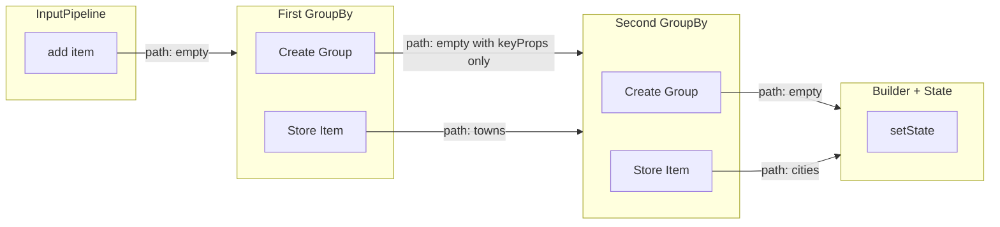
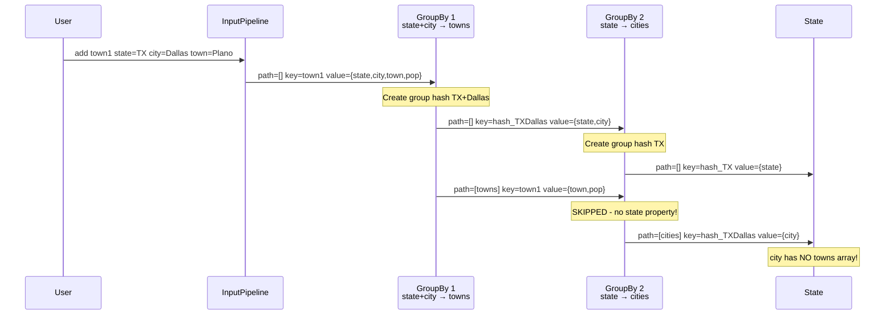
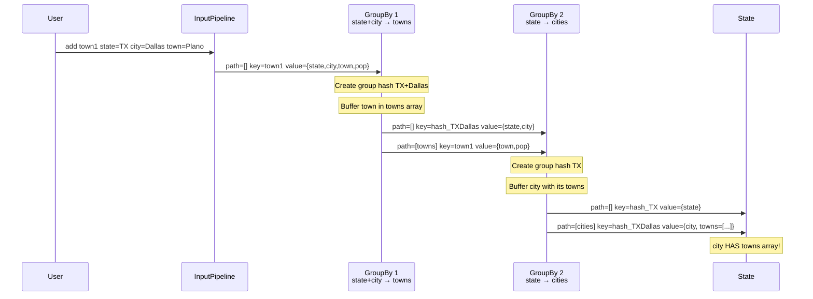
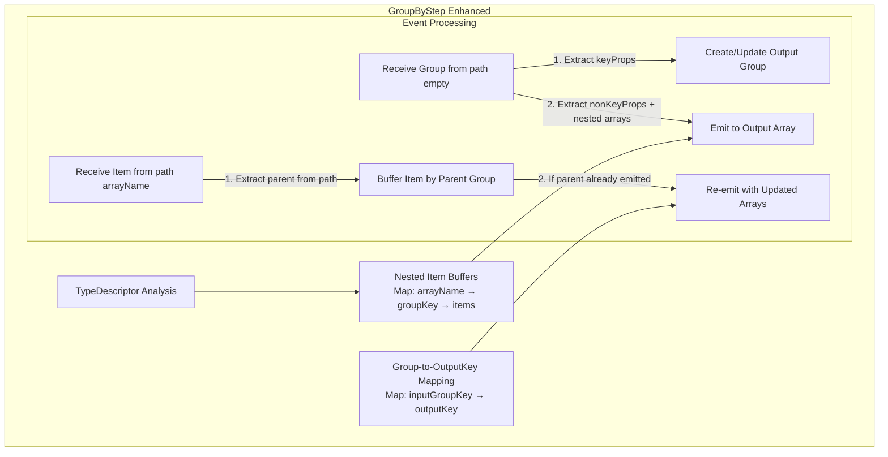
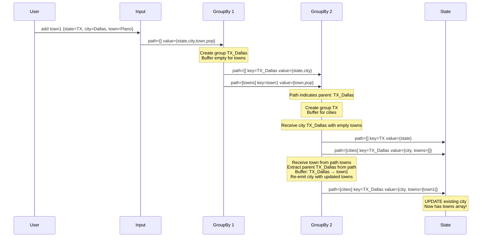
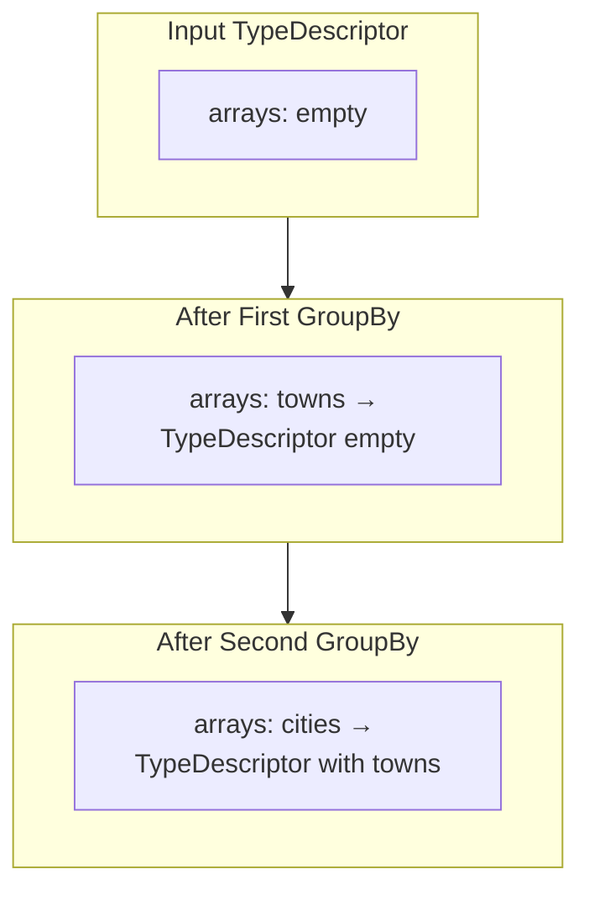

# Nested GroupBy Architecture Design

## Problem Statement

The aggregator pipeline library fails to properly handle chained `groupBy` operations. When multiple `groupBy` steps are chained, nested array data is not propagated correctly.

### Test Scenario

```typescript
createPipeline<{ state: string, city: string, town: string, population: number }>()
    .groupBy(['state', 'city'], 'towns')   // Group by state+city, put remaining in 'towns'
    .groupBy(['state'], 'cities')          // Group by state, put cities in 'cities'
```

**Expected Output:**
```typescript
[
  {
    state: 'TX',
    cities: [
      { city: 'Dallas', towns: [{ town: 'Plano', population: 1000000 }, ...] },
      { city: 'Houston', towns: [{ town: 'Houston', population: 5000000 }, ...] }
    ]
  },
  ...
]
```

**Actual Output:**
```typescript
[
  {
    state: 'TX',
    cities: [
      { city: 'Dallas' },  // Missing towns array!
      { city: 'Houston' }  // Missing towns array!
    ]
  },
  ...
]
```

---

## Current Architecture Analysis

### Event Flow Overview



### Current GroupByStep Behavior

The [`GroupByStep`](../src/steps/group-by.ts) processes items as follows:

1. **Receives input** from its upstream step via `onAdded(path, handler)`
2. **Creates groups** by extracting key properties and computing a hash
3. **Emits group events** to path `[]` with ONLY key properties
4. **Emits item events** to path `[arrayName]` with non-key properties

### Identified Failure Points

#### Failure Point 1: Group Emission Only Contains Key Properties

At [`group-by.ts:106`](../src/steps/group-by.ts:106):
```typescript
// Emit the group (path [])
const groupHandler = this.addedHandlers.get('');
if (groupHandler) {
    groupHandler([], groupKey, group.keyProps);  // ← Only keyProps!
}
```

When a group is created, only `keyProps` (`{ state, city }`) is emitted, NOT the complete object with nested arrays.

#### Failure Point 2: Nested Array Items Are Skipped

At [`group-by.ts:55-64`](../src/steps/group-by.ts:55):
```typescript
const hasAllKeyProperties = this.keyProperties.every(prop => {
    const propStr = String(prop);
    return propStr in immutableProps && props[propStr] !== undefined;
});
if (!hasAllKeyProperties) {
    if (inputPath.length > 0) {
        return;  // ← Items from nested arrays are SKIPPED!
    }
}
```

Items from path `['towns']` don't have the `state` key property, so they're skipped by the second `groupBy`.

#### Failure Point 3: Builder Only Captures Last Step

At [`builder.ts:41-60`](../src/builder.ts:41):
```typescript
paths.forEach(path => {
    this.lastStep.onAdded(path, (path, key, immutableProps) => {
        setState(state => { /* ... */ });
    });
});
```

The builder only registers handlers on `lastStep`, so intermediate step events (first groupBy's groups and items) are not captured in state.

---

## Data Flow Trace

### Current Behavior (Failing)



### Expected Behavior



---

## Proposed Solution: Nested Item Buffering

### Design Overview

The solution modifies `GroupByStep` to:
1. **Recognize nested input arrays** from the input's TypeDescriptor
2. **Buffer items from nested array paths** keyed by their parent group
3. **Include buffered nested arrays** when emitting to output array path
4. **Re-emit items** when nested array content changes

### Architecture Diagram



### Key Data Structures

```typescript
class GroupByStep<T extends {}, K extends keyof T, ArrayName extends string> {
    // Existing state
    private groups: Map<string, GroupData>;
    private itemToGroup: Map<string, GroupInfo>;
    
    // NEW: Track nested array names from input TypeDescriptor
    private inputArrayNames: string[] = [];
    
    // NEW: Buffer nested items by their parent group
    // Map: inputArrayName -> inputGroupKey -> items[]
    private nestedItemBuffers: Map<string, Map<string, any[]>> = new Map();
    
    // NEW: Track which input groups have been emitted to output array
    // Map: inputGroupKey -> outputKey
    private groupToOutputKey: Map<string, string> = new Map();
}
```

### Modified Event Processing

#### 1. Constructor Enhancement

```typescript
constructor(
    private input: Step<T>,
    private keyProperties: K[],
    private arrayName: ArrayName
) {
    // Analyze input TypeDescriptor to find nested arrays
    const inputDescriptor = this.input.getTypeDescriptor();
    this.inputArrayNames = inputDescriptor.arrays.map(arr => arr.name);
    
    // Initialize buffers for each input array
    for (const arrName of this.inputArrayNames) {
        this.nestedItemBuffers.set(arrName, new Map());
    }
}
```

#### 2. Processing Items from Path `[]`

When receiving a group from the input step:

```typescript
// Current: Only emits keyProps
groupHandler([], groupKey, group.keyProps);

// Modified: Still emits only keyProps (groups don't have arrays)
// Arrays are attached to ITEMS, not groups
```

When emitting to the output array path:

```typescript
// Current: Only emits nonKeyProps
itemHandler([this.arrayName], inputGroupKey, nonKeyProps);

// Modified: Include nested arrays from buffer
const completeValue = { ...nonKeyProps };
for (const inputArrayName of this.inputArrayNames) {
    const buffer = this.nestedItemBuffers.get(inputArrayName);
    const nestedItems = buffer?.get(inputGroupKey) || [];
    completeValue[inputArrayName] = nestedItems;
}
itemHandler([this.arrayName], inputGroupKey, completeValue);

// Track for re-emission
this.groupToOutputKey.set(inputGroupKey, inputGroupKey);
```

#### 3. Processing Items from Nested Array Paths

When receiving items from path `['inputArrayName']`:

```typescript
onAdded(inputPath, (path, itemKey, itemValue) => {
    if (inputPath.length > 0 && this.inputArrayNames.includes(inputPath[0])) {
        const inputArrayName = inputPath[0];
        
        // Extract parent group key from the path
        // Path format: [parentGroupKey, ...nestedPath]
        // For items in nested arrays, path[0] is the parent group key
        const parentGroupKey = path[0];
        
        // Buffer the item
        const buffer = this.nestedItemBuffers.get(inputArrayName)!;
        if (!buffer.has(parentGroupKey)) {
            buffer.set(parentGroupKey, []);
        }
        buffer.get(parentGroupKey)!.push(itemValue);
        
        // Re-emit if parent was already emitted to output array
        const outputKey = this.groupToOutputKey.get(parentGroupKey);
        if (outputKey) {
            this.reEmitWithNestedArrays(parentGroupKey, outputKey);
        }
    }
});
```

#### 4. Re-emission on Nested Array Update

```typescript
private reEmitWithNestedArrays(inputGroupKey: string, outputKey: string): void {
    const group = this.findGroupByInputKey(inputGroupKey);
    if (!group) return;
    
    const completeValue = { ...group.nonKeyProps };
    for (const inputArrayName of this.inputArrayNames) {
        const buffer = this.nestedItemBuffers.get(inputArrayName);
        completeValue[inputArrayName] = buffer?.get(inputGroupKey) || [];
    }
    
    const itemHandler = this.addedHandlers.get(this.arrayName);
    if (itemHandler) {
        // Re-emit with same key → Builder will UPDATE existing item
        itemHandler([this.arrayName], outputKey, completeValue);
    }
}
```

---

## Updated Data Flow



---

## TypeDescriptor Flow

The `TypeDescriptor` is crucial for understanding nested structure:



This propagation allows each `GroupByStep` to know its input contains nested arrays and process them accordingly.

---

## Implementation Changes Summary

### 1. GroupByStep Modifications

| Component | Current | Modified |
|-----------|---------|----------|
| Constructor | Initialize groups map | + Analyze input TypeDescriptor for arrays |
| State | groups, itemToGroup | + nestedItemBuffers, groupToOutputKey |
| onAdded for groups | Skip if missing key props from nested path | Process nested items separately |
| Emit to array | Only nonKeyProps | nonKeyProps + buffered nested arrays |
| Re-emission | N/A | Re-emit when nested items arrive |

### 2. Files to Modify

1. **[`src/steps/group-by.ts`](../src/steps/group-by.ts)**: Core changes to GroupByStep
2. **[`src/test/pipeline.group-by-nested.test.ts`](../src/test/pipeline.group-by-nested.test.ts)**: Verify fix works

### 3. Backwards Compatibility

Single-level `groupBy` continues to work because:
- If input TypeDescriptor has no arrays, `inputArrayNames` is empty
- No buffering occurs for non-nested inputs
- Output emission is unchanged (empty nested arrays omitted)

---

## Alternative Approaches Considered

### Alternative A: Multi-Step State Tracking

**Approach:** Builder registers handlers on ALL steps, not just lastStep. Intermediate state is captured and `extract()` reconstructs the full structure.

**Pros:**
- No changes to GroupByStep
- State contains complete picture

**Cons:**
- Requires significant builder changes
- More complex state management
- Extract function becomes more complex

### Alternative B: Modify Extract Function Only

**Approach:** Fix `extract()` to properly reconstruct nested structure from existing state.

**Pros:**
- Minimal changes required
- No event-flow changes

**Cons:**
- Requires intermediate groups in state (currently not captured)
- Would need builder changes anyway

### Alternative C: Lazy Array References

**Approach:** Instead of including arrays in emitted values, include references. Resolve at query time.

**Pros:**
- Avoids re-emission overhead
- Clean separation of concerns

**Cons:**
- Requires new reference mechanism
- Extract function needs major changes
- Not aligned with current architecture

---

## Recommended Approach

**Nested Item Buffering (This Document)** is recommended because:

1. **Localized Changes**: Modifications are contained within `GroupByStep`
2. **Preserves Architecture**: Event-driven model remains intact
3. **Backwards Compatible**: Single-level groupBy unchanged
4. **Testable**: Clear expected behavior at each step
5. **Performant**: Re-emission only when needed, builder handles updates efficiently

---

## Testing Strategy

### Unit Tests for GroupByStep

1. Test nested item buffering initialization
2. Test buffer population from nested paths
3. Test complete value emission with nested arrays
4. Test re-emission on nested item addition
5. Test removal handling with nested items

### Integration Tests

1. Two-level nesting (existing failing test)
2. Three-level nesting (state → city → town → building)
3. Multiple arrays per level
4. Removal cascading through nested structure

---

## Implementation Checklist

- [ ] Add `inputArrayNames` tracking to GroupByStep constructor
- [ ] Initialize `nestedItemBuffers` map
- [ ] Modify onAdded to handle items from nested array paths
- [ ] Update item emission to include buffered nested arrays
- [ ] Implement re-emission when nested items are added
- [ ] Handle removal of nested items (update or re-emit)
- [ ] Update TypeDescriptor to properly reflect nested structure
- [ ] Add unit tests for new functionality
- [ ] Verify existing single-level tests still pass
- [ ] Verify nested groupBy test passes