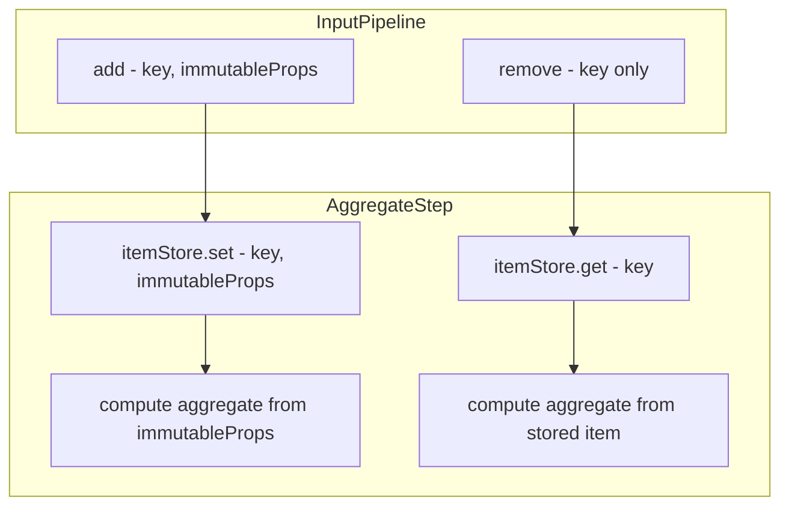
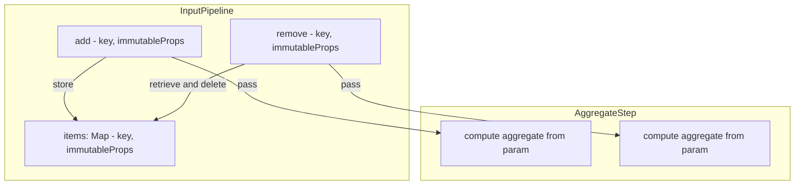

# Adding Immutable Properties to RemovedHandler

## Executive Summary

This document documents the implementation of `immutableProps` in the `RemovedHandler` signature. This change enables stateless step implementations (like `FilterStep`) and simplifies existing aggregate steps by eliminating per-step item storage.

**Status: ✅ Implemented**

The decision to add `immutableProps` to the `remove` pipeline function has been approved and implemented. This document serves as the authoritative reference for this architectural decision.

---

## 1. Current State Analysis

### 1.1 Handler Signatures

From [`src/pipeline.ts:19-23`](../src/pipeline.ts:19):

```typescript
export type AddedHandler = (path: string[], key: string, immutableProps: ImmutableProps) => void;
export type RemovedHandler = (path: string[], key: string) => void;  // No immutableProps!
export type ModifiedHandler = (path: string[], key: string, name: string, value: any) => void;
```

**Key observation**: `AddedHandler` receives `immutableProps`, but `RemovedHandler` does not. This asymmetry forces steps to maintain their own item storage to access item data during removal.

### 1.2 Current Item Storage Patterns

Multiple steps maintain `itemStore: Map<string, ImmutableProps>` to work around this limitation:

| Step | Line | Storage Field | Purpose |
|------|------|---------------|---------|
| [`CommutativeAggregateStep`](../src/steps/commutative-aggregate.ts:75) | 75 | `itemStore` | Lookup item for subtract operation |
| [`MinMaxAggregateStep`](../src/steps/min-max-aggregate.ts:27) | 27 | `itemStore` | Lookup item value for removal recalculation |
| [`AverageAggregateStep`](../src/steps/average-aggregate.ts:35) | 35 | `itemStore` | Lookup item value for average recalculation |
| [`PickByMinMaxStep`](../src/steps/pick-by-min-max.ts:53) | 53 | `itemStore` | Lookup item for recalculation |

### 1.3 InputPipeline Current Implementation

From [`src/factory.ts:6-36`](../src/factory.ts:6):

```typescript
class InputPipeline<T> implements Pipeline<T>, Step {
    private addedHandlers: AddedHandler[] = [];
    private removedHandlers: RemovedHandler[] = [];
    // NOTE: No item storage!

    add(key: string, immutableProps: T): void {
        this.addedHandlers.forEach(handler => handler([], key, immutableProps as ImmutableProps));
    }

    remove(key: string): void {
        // Cannot pass immutableProps - doesn't have them!
        this.removedHandlers.forEach(handler => handler([], key));
    }
}
```

### 1.4 GroupByStep Current Behavior

From [`src/steps/group-by.ts:234-265`](../src/steps/group-by.ts:234):

```typescript
private handleRemoved(keyPath: string[], itemKey: string, immutableProps: ImmutableProps) {
    // Now receives immutableProps!
    const groupKey = this.itemKeyToGroupKey.get(itemKey);
    
    // Notify item removed handlers - can pass immutableProps
    this.itemRemovedHandlers.forEach(handler => handler([...parentKeyPath, groupKey], itemKey, immutableProps));
    
    // ... group removal logic ...
    this.groupRemovedHandlers.forEach(handler => handler(parentKeyPath, groupKey, immutableProps));
}
```

---

## 2. Implementation Details

### 2.1 RemovedHandler Signature

The `RemovedHandler` signature in [`src/pipeline.ts:21`](../src/pipeline.ts:21) now includes `immutableProps`:

```typescript
export type RemovedHandler = (path: string[], key: string, immutableProps: ImmutableProps) => void;
```

This matches the `AddedHandler` signature, providing symmetry in the API.

### 2.2 Step Interface Impact

The [`Step`](../src/pipeline.ts:38) interface's `onRemoved` method signature remains unchanged since it accepts `RemovedHandler` as a type:

```typescript
export interface Step {
    getTypeDescriptor(): TypeDescriptor;
    onAdded(pathSegments: string[], handler: AddedHandler): void;
    onRemoved(pathSegments: string[], handler: RemovedHandler): void;  // No change needed
    onModified(pathSegments: string[], handler: ModifiedHandler): void;
}
```

---

## 3. InputPipeline Implementation

### 3.1 Item Storage

The [`InputPipeline`](../src/factory.ts:6) class now stores items to pass them during removal:

```typescript
class InputPipeline<T> implements Pipeline<T>, Step {
    private addedHandlers: AddedHandler[] = [];
    private removedHandlers: RemovedHandler[] = [];
    private items: Map<string, T> = new Map();  // Stores items for removal

    add(key: string, immutableProps: T): void {
        this.items.set(key, immutableProps);  // Store for later removal
        this.addedHandlers.forEach(handler => handler([], key, immutableProps as ImmutableProps));
    }

    remove(key: string): void {
        const immutableProps = this.items.get(key);
        if (immutableProps !== undefined) {
            this.items.delete(key);
            // Pass immutableProps to handlers
            this.removedHandlers.forEach(handler => handler([], key, immutableProps as ImmutableProps));
        }
        // If item not found, silently ignore (already removed)
    }

    onRemoved(pathSegments: string[], handler: RemovedHandler): void {
        if (pathSegments.length === 0) {
            this.removedHandlers.push(handler);
        }
    }
    
    // ... rest unchanged
}
```

### 3.2 Design Decisions

**Error handling for missing items**: If `remove()` is called for a key that wasn't added (or was already removed), the implementation silently ignores the call rather than throwing. This handles idempotent removal scenarios.

---

## 4. GroupByStep Implementation

### 4.1 Overview

[`GroupByStep`](../src/steps/group-by.ts:6) now receives and forwards `immutableProps` during removal events. The implementation uses Option B (re-extract props from received immutableProps) for cleaner, stateless operation:

### 4.2 Implementation Approach

The implementation re-extracts key and non-key props from the received `immutableProps`:

```typescript
private handleRemoved(keyPath: string[], itemKey: string, immutableProps: ImmutableProps) {
    // Extract grouping and non-grouping props from received immutableProps
    let groupingValues: ImmutableProps = {};
    let nonGroupingProps: ImmutableProps = {};
    Object.keys(immutableProps).forEach(prop => {
        if (this.groupingProperties.includes(prop as K)) {
            groupingValues[prop] = immutableProps[prop];
        } else {
            nonGroupingProps[prop] = immutableProps[prop];
        }
    });
    
    // ... use extracted props for item and group removal notifications ...
}
```

This approach requires no additional storage since `immutableProps` is now available from upstream.

### 4.3 Nested Path Handler Implementation

The nested path removal interceptors forward `immutableProps` through the handler chain:

```typescript
this.input.onRemoved([...this.scopeSegments, ...shiftedSegments], (notifiedKeyPath, itemKey, immutableProps) => {
    const itemKeyAtScope = notifiedKeyPath[this.scopeSegments.length];
    const groupKey = this.itemKeyToGroupKey.get(itemKeyAtScope);
    // ...
    handler(modifiedKeyPath, itemKey, immutableProps);  // Pass through immutableProps
});
```

---

## 5. Aggregate Step Simplifications

### 5.1 CommutativeAggregateStep

With `immutableProps` available in removal events, the [`itemStore`](../src/steps/commutative-aggregate.ts:75) is no longer needed:
```typescript
class CommutativeAggregateStep {
    // No itemStore needed!
    
    private handleItemAdded(keyPath: string[], itemKey: string, item: ImmutableProps): void {
        // No storage needed - item passed directly
        const parentKeyHash = computeKeyPathHash(keyPath);
        
        const currentAggregate = this.aggregateValues.get(parentKeyHash);
        const newAggregate = this.config.add(currentAggregate, item);
        this.aggregateValues.set(parentKeyHash, newAggregate);
        
        // ... emit modification ...
    }
    
    private handleItemRemoved(keyPath: string[], itemKey: string, item: ImmutableProps): void {
        // item is now passed as parameter!
        const parentKeyHash = computeKeyPathHash(keyPath);
        
        const currentAggregate = this.aggregateValues.get(parentKeyHash);
        const newAggregate = this.config.subtract(currentAggregate!, item);
        
        // ... rest of logic ...
    }
}
```

### 5.2 MinMaxAggregateStep

The [`itemStore`](../src/steps/min-max-aggregate.ts:27) simplification follows the same pattern:

```typescript
private handleItemRemoved(keyPath: string[], itemKey: string, item: ImmutableProps): void {
    // item is received as parameter - no lookup needed!
    const value = item[this.numericProperty];
    // ... rest of logic ...
}
```

### 5.3 AverageAggregateStep

The [`itemStore`](../src/steps/average-aggregate.ts:35) follows the same pattern.

### 5.4 PickByMinMaxStep

The [`itemStore`](../src/steps/pick-by-min-max.ts:53) follows the same pattern.

### 5.5 Summary of Simplified Steps

| Step | Storage Eliminated | Benefit |
|------|-------------------|---------|
| `CommutativeAggregateStep` | `itemStore: Map` | Simpler, stateless removal handling |
| `MinMaxAggregateStep` | `itemStore: Map` | Direct access to item in removal handler |
| `AverageAggregateStep` | `itemStore: Map` | No redundant storage |
| `PickByMinMaxStep` | `itemStore: Map` | Centralized item storage in InputPipeline |

---

## 6. Impact on Other Steps

### 6.1 DefinePropertyStep

[`DefinePropertyStep`](../src/steps/define-property.ts:29) passes through removal events with the updated signature:

```typescript
onRemoved(pathSegments: string[], handler: RemovedHandler): void {
    this.input.onRemoved(pathSegments, handler);  // Handler signature includes immutableProps
}
```

### 6.2 DropPropertyStep

[`DropPropertyStep`](../src/steps/drop-property.ts:119) now filters `immutableProps` to remove dropped properties during removal:

```typescript
onRemoved(pathSegments: string[], handler: RemovedHandler): void {
    if (this.isArrayProperty) {
        if (this.isAtOrBelowTargetArray(pathSegments)) {
            return;  // Suppress
        }
    }
    // For property suppression on removal, filter immutableProps
    if (!this.isArrayProperty && this.isAtScopeSegments(pathSegments)) {
        this.input.onRemoved(pathSegments, (keyPath, key, immutableProps) => {
            const { [this.propertyName]: _, ...rest } = immutableProps;
            handler(keyPath, key, rest as Omit<T, K>);
        });
    } else {
        this.input.onRemoved(pathSegments, handler);
    }
}
```

---

## 7. Builder State Handler Updates

### 7.1 build() Method

The [`build()`](../src/builder.ts:477) method's removal handler now receives `immutableProps`:

```typescript
this.lastStep.onRemoved(segmentPath, (keyPath, key, immutableProps) => {
    // immutableProps available but not needed for removal from keyed array
    setState(state => removeFromKeyedArray(state, segmentPath, keyPath, key) as KeyedArray<T>);
});
```

No functional change needed - `removeFromKeyedArray` doesn't use `immutableProps`, but the parameter is now available for steps that need it.

---

## 8. Edge Cases and Considerations

### 8.1 Removing Non-Existent Items

If `remove()` is called for a key that was never added:

**InputPipeline behavior**:
```typescript
remove(key: string): void {
    const immutableProps = this.items.get(key);
    if (immutableProps !== undefined) {
        this.items.delete(key);
        this.removedHandlers.forEach(handler => handler([], key, immutableProps as ImmutableProps));
    }
    // Silently ignore if not found - idempotent removal
}
```

### 8.2 Double Removal

If `remove()` is called twice for the same key:
- First call: Item found, removed, handlers notified
- Second call: Item not found, silently ignored

This is safe behavior for eventual consistency scenarios.

### 8.3 Memory Considerations

**Before**: Each aggregate step stored items independently, leading to potential duplication:
- If 3 aggregate steps exist in a pipeline, each stores all items
- Memory usage: 3 × N items

**After**: Items stored once in `InputPipeline`:
- Memory usage: 1 × N items
- Note: `GroupByStep` still needs to store non-key props unless it receives full `immutableProps`

### 8.4 Steps That Don't Need immutableProps

Some removal handlers don't need `immutableProps`:
- [`removeFromKeyedArray`](../src/builder.ts:534) - only needs path and key
- Pass-through steps - just forward events

These handlers can simply ignore the third parameter.

### 8.5 Determinism with Immutable Items

Since items are immutable, re-extracting properties from `immutableProps` during removal yields the same result as at addition time. This enables the stateless `FilterStep` design described in [`docs/filter-design.md`](filter-design.md).

---

## 9. Implementation Status

### 9.1 Completed Implementation

The following changes have been implemented:

1. **✅ Phase 1: Core API Change**
   - Updated [`RemovedHandler`](../src/pipeline.ts:21) signature to include `immutableProps`
   - Updated [`InputPipeline`](../src/factory.ts:6) to store items and pass them during removal
   - Updated [`build()`](../src/builder.ts:486) handler to accept the new parameter

2. **✅ Phase 2: GroupByStep**
   - Updated [`handleRemoved`](../src/steps/group-by.ts:234) to accept and use `immutableProps`
   - Updated item/group removal notifications to pass `immutableProps`
   - Updated nested path interceptors

3. **✅ Phase 3: Aggregate Step Simplifications**
   - Updated [`CommutativeAggregateStep`](../src/steps/commutative-aggregate.ts) to use passed `immutableProps`
   - Updated [`MinMaxAggregateStep`](../src/steps/min-max-aggregate.ts) similarly
   - Updated [`AverageAggregateStep`](../src/steps/average-aggregate.ts) similarly
   - Updated [`PickByMinMaxStep`](../src/steps/pick-by-min-max.ts) similarly

4. **✅ Phase 4: Property Steps**
   - Updated [`DefinePropertyStep`](../src/steps/define-property.ts)
   - Updated [`DropPropertyStep`](../src/steps/drop-property.ts)

### 9.2 Enabled Future Work

With `immutableProps` available in removal events, the following is now possible:

- **Stateless `FilterStep`** - Can re-evaluate predicates on removal without storing item data
- **Simplified step implementations** - New steps can be designed without per-step item storage

---

## 10. Event Flow Diagrams

### 10.1 Before: Aggregate Step with Item Storage



### 10.2 After: Aggregate Step Without Item Storage



### 10.3 GroupByStep Event Flow


---

## 11. Summary

This architectural change has been implemented and provides:

1. **`immutableProps` in `RemovedHandler`** - All steps now have access to item data during removal events
2. **Centralized item storage in `InputPipeline`** - Single source of truth for item data
3. **Stateless step implementations** - Steps like `FilterStep` can be implemented without storing item data
4. **Simplified aggregate steps** - Redundant `itemStore` fields eliminated from aggregate steps
5. **Backward compatible behavior** - All existing functionality preserved with additional data available

The key architectural insight is that items are immutable, so storing them once at the input level and passing them through all events provides complete information to all steps without duplication. This decision simplifies the overall pipeline architecture and enables cleaner step implementations.

### API Reference

**RemovedHandler signature:**
```typescript
export type RemovedHandler = (path: string[], key: string, immutableProps: ImmutableProps) => void;
```

**Available immutableProps in remove handlers:**
- Contains all properties that were passed when the item was added
- Properties are unchanged (immutable) from addition time
- Can be used to re-evaluate predicates, extract values for aggregation reversal, etc.