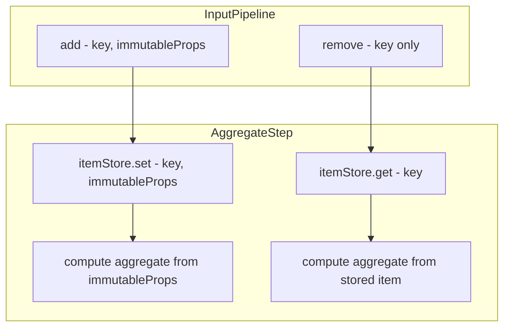
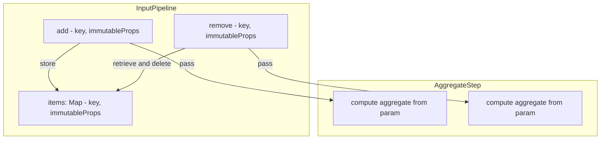
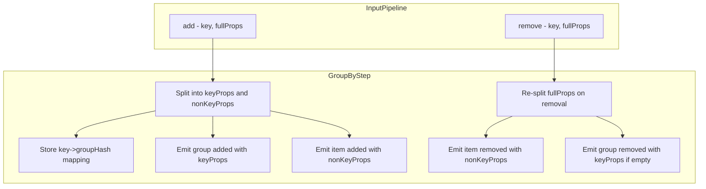

# Adding Immutable Properties to RemovedHandler

## Executive Summary

This document describes the design for adding `immutableProps` to the `RemovedHandler` signature. This change enables stateless step implementations (like the upcoming `FilterStep`) and simplifies existing aggregate steps by eliminating per-step item storage.

---

## 1. Current State Analysis

### 1.1 Handler Signatures

From [`src/pipeline.ts:19-23`](../src/pipeline.ts:19):

```typescript
export type AddedHandler = (path: string[], key: string, immutableProps: ImmutableProps) => void;
export type RemovedHandler = (path: string[], key: string) => void;  // No immutableProps!
export type ModifiedHandler = (path: string[], key: string, name: string, value: any) => void;
```

**Key observation**: `AddedHandler` receives `immutableProps`, but `RemovedHandler` does not. This asymmetry forces steps to maintain their own item storage to access item data during removal.

### 1.2 Current Item Storage Patterns

Multiple steps maintain `itemStore: Map<string, ImmutableProps>` to work around this limitation:

| Step | Line | Storage Field | Purpose |
|------|------|---------------|---------|
| [`CommutativeAggregateStep`](../src/steps/commutative-aggregate.ts:75) | 75 | `itemStore` | Lookup item for subtract operation |
| [`MinMaxAggregateStep`](../src/steps/min-max-aggregate.ts:27) | 27 | `itemStore` | Lookup item value for removal recalculation |
| [`AverageAggregateStep`](../src/steps/average-aggregate.ts:35) | 35 | `itemStore` | Lookup item value for average recalculation |
| [`PickByMinMaxStep`](../src/steps/pick-by-min-max.ts:53) | 53 | `itemStore` | Lookup item for recalculation |

### 1.3 InputPipeline Current Implementation

From [`src/factory.ts:6-36`](../src/factory.ts:6):

```typescript
class InputPipeline<T> implements Pipeline<T>, Step {
    private addedHandlers: AddedHandler[] = [];
    private removedHandlers: RemovedHandler[] = [];
    // NOTE: No item storage!

    add(key: string, immutableProps: T): void {
        this.addedHandlers.forEach(handler => handler([], key, immutableProps as ImmutableProps));
    }

    remove(key: string): void {
        // Cannot pass immutableProps - doesn't have them!
        this.removedHandlers.forEach(handler => handler([], key));
    }
}
```

### 1.4 GroupByStep Current Behavior

From [`src/steps/group-by.ts:234-265`](../src/steps/group-by.ts:234):

```typescript
private handleRemoved(path: string[], key: string) {
    // Cannot access immutableProps - doesn't receive them!
    const keyHash = this.keyToGroupHash.get(key);
    
    // Notify item removed handlers - cannot pass immutableProps
    this.itemRemovedHandlers.forEach(handler => handler([...parentPath, keyHash], key));
    
    // ... group removal logic ...
    this.groupRemovedHandlers.forEach(handler => handler(parentPath, keyHash));
}
```

---

## 2. Proposed Changes

### 2.1 Modified RemovedHandler Signature

In [`src/pipeline.ts:21`](../src/pipeline.ts:21):

```typescript
// Before
export type RemovedHandler = (path: string[], key: string) => void;

// After
export type RemovedHandler = (path: string[], key: string, immutableProps: ImmutableProps) => void;
```

### 2.2 Step Interface Impact

The [`Step`](../src/pipeline.ts:38) interface's `onRemoved` method signature remains unchanged since it accepts `RemovedHandler` as a type:

```typescript
export interface Step {
    getTypeDescriptor(): TypeDescriptor;
    onAdded(pathNames: string[], handler: AddedHandler): void;
    onRemoved(pathNames: string[], handler: RemovedHandler): void;  // No change needed
    onModified(pathNames: string[], handler: ModifiedHandler): void;
}
```

---

## 3. InputPipeline Changes

### 3.1 Required Changes

The [`InputPipeline`](../src/factory.ts:6) class must store items to pass them during removal:

```typescript
class InputPipeline<T> implements Pipeline<T>, Step {
    private addedHandlers: AddedHandler[] = [];
    private removedHandlers: RemovedHandler[] = [];
    private items: Map<string, T> = new Map();  // NEW: Store items

    add(key: string, immutableProps: T): void {
        this.items.set(key, immutableProps);  // NEW: Store for later removal
        this.addedHandlers.forEach(handler => handler([], key, immutableProps as ImmutableProps));
    }

    remove(key: string): void {
        const immutableProps = this.items.get(key);
        if (immutableProps !== undefined) {
            this.items.delete(key);
            // NEW: Pass immutableProps to handlers
            this.removedHandlers.forEach(handler => handler([], key, immutableProps as ImmutableProps));
        }
        // If item not found, silently ignore (already removed)
    }

    onRemoved(path: string[], handler: RemovedHandler): void {
        if (path.length === 0) {
            this.removedHandlers.push(handler);
        }
    }
    
    // ... rest unchanged
}
```

### 3.2 Design Considerations

**Error handling for missing items**: If `remove()` is called for a key that wasn't added (or was already removed), the implementation should silently ignore the call rather than throwing. This handles idempotent removal scenarios.

---

## 4. GroupByStep Changes

### 4.1 Current State

[`GroupByStep`](../src/steps/group-by.ts:6) maintains several maps but does NOT store the actual item `immutableProps`:

```typescript
keyToGroupHash: Map<string, string> = new Map<string, string>();
groupToKeys: Map<string, Set<string>> = new Map<string, Set<string>>();
keyToParentPath: Map<string, string[]> = new Map<string, string[]>();
// Missing: item props storage
```

### 4.2 Required Changes

**Option A: Store full item props**

Add storage for the non-key properties (item-level immutableProps):

```typescript
// NEW: Store item's non-key properties for removal
private itemPropsStore: Map<string, ImmutableProps> = new Map();
```

Modify [`handleAdded`](../src/steps/group-by.ts:196):

```typescript
private handleAdded(path: string[], key: string, immutableProps: ImmutableProps) {
    // ... existing key extraction logic ...
    
    // Extract non-key properties
    let nonKeyProps: ImmutableProps = {};
    Object.keys(immutableProps).forEach(prop => {
        if (!this.keyProperties.includes(prop as K)) {
            nonKeyProps[prop] = immutableProps[prop];
        }
    });
    
    // NEW: Store for removal
    this.itemPropsStore.set(key, nonKeyProps);
    
    // Notify item handlers
    this.itemAddedHandlers.forEach(handler => handler([...parentPath, keyHash], key, nonKeyProps));
}
```

Modify [`handleRemoved`](../src/steps/group-by.ts:234):

```typescript
private handleRemoved(path: string[], key: string, immutableProps: ImmutableProps) {
    const parentPath = this.keyToParentPath.get(key) || path;
    const keyHash = this.keyToGroupHash.get(key);
    
    // Get stored non-key props for item removal notification
    const nonKeyProps = this.itemPropsStore.get(key);
    this.itemPropsStore.delete(key);
    
    // Notify item removed handlers WITH immutableProps
    this.itemRemovedHandlers.forEach(handler => 
        handler([...parentPath, keyHash], key, nonKeyProps || {})
    );
    
    // ... rest of removal logic ...
    
    if (groupKeys.size === 0) {
        // For group removal, reconstruct key props from immutableProps
        let keyProps: ImmutableProps = {};
        this.keyProperties.forEach(prop => {
            keyProps[prop as string] = immutableProps[prop as string];
        });
        
        // Notify group removed handlers WITH keyProps
        this.groupRemovedHandlers.forEach(handler => 
            handler(parentPath, keyHash, keyProps)
        );
    }
}
```

**Option B: Re-extract props from received immutableProps**

Since `GroupByStep` will now receive `immutableProps` in its removal callback, it can re-extract key/non-key props:

```typescript
private handleRemoved(path: string[], key: string, immutableProps: ImmutableProps) {
    // Re-extract key and non-key props from received immutableProps
    let keyProps: ImmutableProps = {};
    let nonKeyProps: ImmutableProps = {};
    Object.keys(immutableProps).forEach(prop => {
        if (this.keyProperties.includes(prop as K)) {
            keyProps[prop] = immutableProps[prop];
        } else {
            nonKeyProps[prop] = immutableProps[prop];
        }
    });
    
    // ... use extracted props ...
}
```

**Recommendation**: Option B is cleaner - no additional storage needed if we receive full `immutableProps` from upstream.

### 4.3 Nested Path Handler Updates

The nested path removal interceptors at [lines 130-141](../src/steps/group-by.ts:130) also need updating:

```typescript
// Before (line 130-141)
this.input.onRemoved([...this.scopePath, ...shiftedPath], (notifiedPath, key) => {
    // ...
    handler(modifiedPath, key);  // No immutableProps
});

// After
this.input.onRemoved([...this.scopePath, ...shiftedPath], (notifiedPath, key, immutableProps) => {
    const itemHash = notifiedPath[this.scopePath.length];
    const groupHash = this.keyToGroupHash.get(itemHash);
    // ...
    handler(modifiedPath, key, immutableProps);  // Pass through immutableProps
});
```

---

## 5. Aggregate Step Simplifications

### 5.1 CommutativeAggregateStep

The [`itemStore`](../src/steps/commutative-aggregate.ts:75) can be removed entirely:

**Before:**
```typescript
class CommutativeAggregateStep {
    private itemStore: Map<string, ImmutableProps> = new Map();  // Can be removed
    
    private handleItemAdded(runtimePath: string[], itemKey: string, item: ImmutableProps): void {
        // Store item for later removal
        this.itemStore.set(itemHash, item);  // No longer needed
        // ...
    }
    
    private handleItemRemoved(runtimePath: string[], itemKey: string): void {
        const item = this.itemStore.get(itemHash);  // No longer needed
        // ...
    }
}
```

**After:**
```typescript
class CommutativeAggregateStep {
    // No itemStore needed!
    
    private handleItemAdded(runtimePath: string[], itemKey: string, item: ImmutableProps): void {
        // No storage needed - item passed directly
        const parentHash = computePathHash(runtimePath);
        
        const currentAggregate = this.aggregateValues.get(parentHash);
        const newAggregate = this.config.add(currentAggregate, item);
        this.aggregateValues.set(parentHash, newAggregate);
        
        // ... emit modification ...
    }
    
    private handleItemRemoved(runtimePath: string[], itemKey: string, item: ImmutableProps): void {
        // item is now passed as parameter!
        const parentHash = computePathHash(runtimePath);
        
        const currentAggregate = this.aggregateValues.get(parentHash);
        const newAggregate = this.config.subtract(currentAggregate!, item);
        
        // ... rest of logic ...
    }
}
```

### 5.2 MinMaxAggregateStep

Similar simplification - remove [`itemStore`](../src/steps/min-max-aggregate.ts:27):

```typescript
// Before: lines 145-151
const item = this.itemStore.get(itemHash);
if (!item) {
    throw new Error(`Item ${itemKey} not found in item store`);
}
this.itemStore.delete(itemHash);

// After: item received as parameter
private handleItemRemoved(runtimePath: string[], itemKey: string, item: ImmutableProps): void {
    // item is the parameter - no lookup needed!
    const value = item[this.numericProperty];
    // ... rest of logic ...
}
```

### 5.3 AverageAggregateStep

Remove [`itemStore`](../src/steps/average-aggregate.ts:35) - same pattern as above.

### 5.4 PickByMinMaxStep

Remove [`itemStore`](../src/steps/pick-by-min-max.ts:53) - same pattern as above.

### 5.5 Summary of Removable Code

| Step | Lines to Remove | Storage Eliminated |
|------|-----------------|-------------------|
| `CommutativeAggregateStep` | ~75, ~152, ~190-196 | `itemStore: Map` |
| `MinMaxAggregateStep` | ~27, ~101, ~145-151 | `itemStore: Map` |
| `AverageAggregateStep` | ~35, ~108, ~153-159 | `itemStore: Map` |
| `PickByMinMaxStep` | ~53, ~133, ~178-184 | `itemStore: Map` |

---

## 6. Impact on Other Steps

### 6.1 DefinePropertyStep

[`DefinePropertyStep`](../src/steps/define-property.ts:29) just passes through removal events - needs signature update only:

```typescript
// Before
onRemoved(pathNames: string[], handler: (path: string[], key: string) => void): void {
    this.input.onRemoved(pathNames, handler);
}

// After
onRemoved(pathNames: string[], handler: RemovedHandler): void {
    this.input.onRemoved(pathNames, handler);  // Handler signature changed, pass-through works
}
```

### 6.2 DropPropertyStep

[`DropPropertyStep`](../src/steps/drop-property.ts:119) also passes through - needs signature update:

```typescript
// Before (line 126)
this.input.onRemoved(pathNames, handler);

// After - handler receives immutableProps, can filter if needed
onRemoved(pathNames: string[], handler: RemovedHandler): void {
    if (this.isArrayProperty) {
        if (this.isAtOrBelowTargetArray(pathNames)) {
            return;  // Suppress
        }
    }
    // For property suppression on removal, filter immutableProps
    if (!this.isArrayProperty && this.isAtScopePath(pathNames)) {
        this.input.onRemoved(pathNames, (path, key, immutableProps) => {
            const { [this.propertyName]: _, ...rest } = immutableProps;
            handler(path, key, rest as Omit<T, K>);
        });
    } else {
        this.input.onRemoved(pathNames, handler);
    }
}
```

---

## 7. Builder State Handler Updates

### 7.1 build() Method

The [`build()`](../src/builder.ts:477) method registers handlers that receive events - the removal handler needs updating:

```typescript
// Before (line 486-488)
this.lastStep.onRemoved(pathName, (path, key) => {
    setState(state => removeFromKeyedArray(state, pathName, path, key) as KeyedArray<T>);
});

// After
this.lastStep.onRemoved(pathName, (path, key, immutableProps) => {
    // immutableProps available but not needed for removal from keyed array
    setState(state => removeFromKeyedArray(state, pathName, path, key) as KeyedArray<T>);
});
```

No functional change needed - `removeFromKeyedArray` doesn't use `immutableProps`.

---

## 8. Edge Cases and Considerations

### 8.1 Removing Non-Existent Items

If `remove()` is called for a key that was never added:

**InputPipeline behavior**:
```typescript
remove(key: string): void {
    const immutableProps = this.items.get(key);
    if (immutableProps !== undefined) {
        this.items.delete(key);
        this.removedHandlers.forEach(handler => handler([], key, immutableProps as ImmutableProps));
    }
    // Silently ignore if not found - idempotent removal
}
```

### 8.2 Double Removal

If `remove()` is called twice for the same key:
- First call: Item found, removed, handlers notified
- Second call: Item not found, silently ignored

This is safe behavior for eventual consistency scenarios.

### 8.3 Memory Considerations

**Before**: Each aggregate step stored items independently, leading to potential duplication:
- If 3 aggregate steps exist in a pipeline, each stores all items
- Memory usage: 3 × N items

**After**: Items stored once in `InputPipeline`:
- Memory usage: 1 × N items
- Note: `GroupByStep` still needs to store non-key props unless it receives full `immutableProps`

### 8.4 Steps That Don't Need immutableProps

Some removal handlers don't need `immutableProps`:
- [`removeFromKeyedArray`](../src/builder.ts:534) - only needs path and key
- Pass-through steps - just forward events

These handlers can simply ignore the third parameter.

### 8.5 Determinism with Immutable Items

Since items are immutable, re-extracting properties from `immutableProps` during removal yields the same result as at addition time. This enables the stateless `FilterStep` design described in [`docs/filter-design.md`](filter-design.md).

---

## 9. Migration Path

### 9.1 Implementation Order

1. **Phase 1: Core API Change**
   - Update [`RemovedHandler`](../src/pipeline.ts:21) signature
   - Update [`InputPipeline`](../src/factory.ts:6) to store and pass items
   - Update [`build()`](../src/builder.ts:486) handler (accept param, ignore it)

2. **Phase 2: GroupByStep**
   - Update [`handleRemoved`](../src/steps/group-by.ts:234) to accept `immutableProps`
   - Update item/group removal notifications to pass `immutableProps`
   - Update nested path interceptors

3. **Phase 3: Aggregate Step Simplifications**
   - Update [`CommutativeAggregateStep`](../src/steps/commutative-aggregate.ts) - remove `itemStore`
   - Update [`MinMaxAggregateStep`](../src/steps/min-max-aggregate.ts) - remove `itemStore`
   - Update [`AverageAggregateStep`](../src/steps/average-aggregate.ts) - remove `itemStore`
   - Update [`PickByMinMaxStep`](../src/steps/pick-by-min-max.ts) - remove `itemStore`

4. **Phase 4: Property Steps**
   - Update [`DefinePropertyStep`](../src/steps/define-property.ts)
   - Update [`DropPropertyStep`](../src/steps/drop-property.ts)

5. **Phase 5: New FilterStep** (separate task)
   - Implement stateless `FilterStep` per [`docs/filter-design.md`](filter-design.md)

### 9.2 Testing Strategy

1. **Existing tests should continue to pass** - the change is backward compatible in behavior
2. **Add tests for double-removal** - verify idempotent behavior
3. **Add tests for removal of non-existent items** - verify silent handling
4. **Verify aggregate steps work correctly** after `itemStore` removal

---

## 10. Event Flow Diagrams

### 10.1 Before: Aggregate Step with Item Storage



### 10.2 After: Aggregate Step Without Item Storage



### 10.3 GroupByStep Event Flow



---

## 11. Summary

This design change:

1. **Adds `immutableProps` to `RemovedHandler`** - enabling steps to access item data during removal
2. **Centralizes item storage in `InputPipeline`** - single source of truth
3. **Enables stateless step implementations** - like the upcoming `FilterStep`
4. **Simplifies aggregate steps** - removes redundant `itemStore` fields from 4 steps
5. **Maintains backward compatibility** - existing behavior unchanged, just more data available

The key insight is that items are immutable, so storing them once at the input level and passing them through all events provides complete information to all steps without duplication.